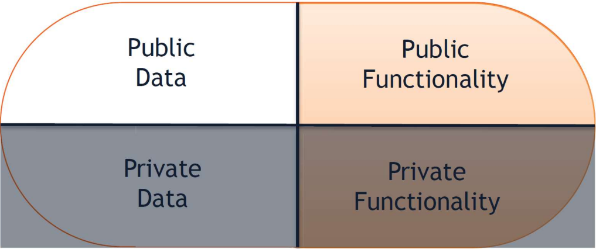

MIT License
Copyright (c) 2025 Emir Baha Yıldırım
Please see the LICENSE file for more details.

> [!NOTE]
> Just a small note, I won't use the word "C++" in my notes. I'll just say
> "cpp". Just to let you know, so that you don't get confused.

-------------------------------------------------------------------------------

# Introduction to C++

C++ is a popular, high-level, cross-platform, object-oriented, general purpose
programming language created by Bjarne Stroustrup in 1985. First it was
released as an extension of the C programming language, adding OOP features;
as of 1997/C++98 standardization, C++ has added functional features, in
addition to facilities for low-level memory manipulation.

## [Philosophy of C++](https://en.wikipedia.org/wiki/C%2B%2B#Philosophy)

Throughout C++'s life, its development and evolution has been guided by a set
of principles:

- It must be driven by actual problems and its features should be immediately
useful in real world programs.
- Every feature should be implementable (with a reasonably obvious way to do
so).
- Programmers should be free to pick their own programming style, and that
style should be fully supported by C++.
- Allowing a useful feature is more important than preventing every possible
misuse of C++.
- It should provide facilities for organizing programs into separate,
well-defined parts, and provide facilities for combining separately developed
parts.
- No implicit violations of the type system (but allow explicit violations;
that is, those explicitly requested by the programmer).
- User-created types need to have the same support and performance as built-in
types.
- Unused features should not negatively impact created executables (e.g. in
lower performance).
- There should be no language beneath C++ (except assembly language).
- C++ should work alongside other existing programming languages, rather than
fostering its own separate and incompatible programming environment.
- If the programmer's intent is unknown, allow the programmer to specify it by
providing manual control.

This should be enough for now.

## A Basic C++ Program

### Example 1

In this program, we will ask the user for a real number, find the square root
of it, and print it in the console.

```cpp
// below are some headers that we've opted to use in this example.
#include <iostream> // allows you to use std::cout and std::cin in this e.g.
#include <math.h> // allows you to use the `sqrt()` function.
// this is how you include them in your code.

using namespace std;
// i probably won't use namespaces unless explicitly asked by the instructor.

// this is your main function. your entire code, except possibly your
// functions, will be in the main function. the int type at the beginning of it
// tells you that this function will return an integer at the end.
int main()
{
    // float is another data type that holds floating point numbers.
    // you should remember them from your CENG240 or other prerequiset courses.
    float x;

    // we're "printing" (console out) that string to the console, and adding a
    // new line after that string.
    cout << "Enter a real number: " << endl;
    // we're awaiting input from the user.
    cin >> x;

    // we're doing the calculation and printing our result in the same line.
    cout << "The square root of " << x << " is: " << sqrt(x) << endl;

    // in most compilers, your main function doesn't need a return value. if it
    // doesn't crash, or doesn't throw a compiler error, it will return 0.
}
```

### Example 2

In this, actually easier, example, we will ask the user to provide us with 2
integers, we will add them up, and print our result.

```cpp
#inclued <iostream>

// the reason i won't use `using` is, first of all it makes the code harder to
// read, because there are way more libraries than the Standard Library.
// secondly, you may confuse them for functions/classes that you've written.
using std::cout;
using std::cin;
using std::endl;

int main()
{
    // we're initializing and assigning 2 integers for the sake of the
    // argument. you don't need to assign them numbers at this stage.
    int a=23;
    int b=34;

    cout << "Enter two integers:" << endl;
    // we're taking 2 inputs, and storing them in their respective variables.
    cin >> a >> b;
    cout << endl;

    cout << "a + b = " << a+b << endl;
    return 0;
    // you can explicitly tell the compiler to return 0 if it reaches this
    // line. it's not necessary, but it makes the code more readable.
}
```

## Data Types in C++

Firstly, C++ is a strongly-type programming language, which means every
variable has a type, name, value, and location in memory. The type of a
variable defines the contents of the varibale. Every type is either:
- primitive, or
- user-defined.

### Some Primitive Data Types

- **int (integer):** a whole number (positive or negative)
- **char (character):** a single character/single byte[^1]
- **bool (boolean):** stores a Boolean (true or false) value
- **float (floating point number):** stores a number with a fractional part
- **double:** stores a double-precision floating point number
- **void:** a valueless special purpose type

### User-Defined Types

An unbounded number of user-defined types can exist, we'll create many. There
are two very common user-defined types:
- **std::string:** stores a string (sequence of characters)
- **std::vector:** stores a dynamically-growing array

## C++ Standard Library (std)

The C++ Standard Library provides a set of commonly used functionality and data
structures to build upon. It's organized into separate sub-libraries (header
files) that can be included in any C++ program with the syntax:
```cpp
#include <header_file>
```
The `iostream` header include operations for reading/writing to files and the
console itself, including `std::cout`.

## Namespaces

A namespace is a declarative regionn that provides a scope to the identifiers
inside it. All functionality used from the standard library will be a part of
the `std` namespace. Namespaces allow programmers to avoid name conflicts for
commonly used names. If a feature from a namespace is used often, it can be
imported into the global space like this example:
```cpp
using std::cout;
```

### Namespace Example

```cpp
namespace first{
    int val = 500;
}

// Global Var
int val = 100;

int main()
{
    // Local Var
    int val = 200;
    // these variables can be accessed from outside the namespace using the
    // scope operator `::`
    cout << first::val << '\n';

    return 0;
}
// Output: 500
```

## Basic Control Structures in C++

All C++ programs are written in terms of three control structures.
- **Sequence Structures:** Programs are executed sequentially by default, which
is built into C++.
- **Selection Structures:** C++ has three types of selection: **if**,
**if/else**, **switch**.
- **Repetition Structures:** C++ has three types of repetition: **while**,
**do/while**, **for**.

-------------------------------------------------------------------------------

# Exercises from the Slides

## Exercise 1

What is the output from the following loop?
```cpp
for (int i=0; i<5; i++){
    cout << i;
}
cout << endl;
```

<details>
    <summary> Solution </summary>

The output will be:
```bash
01234
```
All values that `i` passed through are in a single line, and that's because we
don't have an `std::endl` after printing the value of `i`.
</details>

## Exercise 2

What is the output from the following loop?
```cpp
for (int i=0; i<10; i+=2){
    cout << i << endl;
}
```

<details>
    <summary> Solution </summary>

The output will be:
```bash
0
2
4
6
8
```
This happens because we have `endl` command after every time we print the value
of `i`, and we are incrementing by 2 (`i += 2` is the equivalent of
`i = i + 2`).
</details>

## Exercise 3

```cpp
int i = 24;
while (i > 0){
    cout << i << endl;
    i /= 2;
}
```

What is the output?

<details>
    <summary> Solution </summary>

The output will be:
```bash
24
12
6
3
1
```
`i /= 2` is the equivalent of `i = i/2`.
</details>

-------------------------------------------------------------------------------

# Pointers

Pointers definitely need their own header, because they're used a lot, and it's
one of the hardest concepts to grasp/use in C/C++.

> [!IMPORTANT]
> **A pointer is a a variable that stores a memory address as its value.**
A pointer variable points to a data type (like `int` or `string`) of the same
type, and is created with the `*` operator.

In C++ you can get the memory address of a value with the following syntax:
```cpp
#include <iostream>

int main()
{
    int x = 10;
    int *ptr = &x;

    std::cout << "x: " << x << std::endl;
    std::cout << "Memory address of x: " << ptr << std::endl;
}
```
The variable `ptr` is our pointer to the memory address of our variable `x`.

Output of that code will be something like this:
```terminal
x: 10
Memory address of x: 0x7fffab99ab0c
```

There are three ways to declare pointer variables:
```cpp
string *mystring; // preferred and encouraged
string* mystring;
string * mystring;
```

You can declare pointers to any data type:
```cpp
float *fptr;
char *chptr;
```
We usually initialize pointers to `NULL`.
- `NULL` → points to nothing
```cpp
myPtr = NULL;
```

## Pointer Operators

- **`&` (Address Operator):** Returns the address of the operand.
```cpp
int y = 5;
int *yPtr;
yPtr = &y; // yPtr gets address of y
// yPtr "points to" y
```

- **`\*` (Indirection/Dereferencing Operators):** Returns an alias of what its
operand points to. `\*yPtr` returns `y`, because yPtr points to y. `\*` can be
used for assignment.
```cpp
*yPtr = 7; // changes y to 7
```

> [!NOTE]
> `\*` and `&` are inverses, they cancel each other out.
```cpp
#import <iostream>

int main()
{
    int rate;
    int *p_rate;

    rate = 500;
    p_rate = &rate;

    // print the values
    std::cout << "rate = " << rate << std::endl; // direct access
    std::cout << "rate = " << *p_rate << std::endl; // indirect access
}
```

-------------------------------------------------------------------------------

# Exercises from the Slides

## Exercise 4

What will be the output of the following program?
```cpp
#include <iostream>

int main()
{
    int a, b, *p;

    a = b = 7;
    p = &a;
    // 1st print statement
    std::cout << "*p = " << *p << std::endl;

    *p = 3;
    // 2nd print statement
    std::cout << "a = " << a << std::endl;

    p = &b;

    *p = 2 * *p - a;
    // 3rd print statement
    std::cout << "b = " << b << std::endl;
}
```

<details>
    <summary> Solution </summary>

It will be something like this:
```console
p = 0x7ffcf9562908
a = 3
b = 11
```
- **Print Statement 1:** We've used the pointer `p` to point to the variable
`a`, thus it prints the memory address of `a`.
- **Print Statement 2:** We've used the pointer `p` to change the value of the
variable `a` to 3, and printed the value of `a`.
- **Print Statement 3:** We've changed what variable the pointer `p` points to.
You can think of line 18 as this:
```cpp
b = 2 * b - a;
```
Then, we print the value of b, which is changed to 11.
</details>

-------------------------------------------------------------------------------

# Functions in C++

## (Not Really) Syntax of Functions

```cpp
<data_type> <function_name> (<parameters>) { ... }
```

Example Function:
```cpp
#include <iostream>

void setIntToZero(int *intPointer) {
    *intPointer = 0;
}

int main()
{
    int a = 5;
    std::cout << "a = " << a << std::endl;
    // Output: a = 5
    setIntToZero(&a);
    std::cout << "a = " << a << std::endl;
    // Output: a = 0
}
```

-------------------------------------------------------------------------------

## Why Use Pointers?

> [!NOTE]
> Pointers are mainly used when you cannot use anything else.

The reason we're using pointers in the previous function is that, if you use
this:
```cpp
#include <iostream>

void setToZero(int var) {
    var = 0;
}

int main()
{
    int a = 5;
    std::cout << "a = " << a << std::endl;
    setIntToZero(a);
    std::cout << "a = " << a << std:endl;
}
```
you're not changing the value of the variable `a`. You're calling the variable,
and storing it's value in the variable `var` which is in the scope of the
function. Check this out:
```cpp
#include <iostream>

void setIntToZero(int var) {
    std::cout << "var = " << var << std::endl;
    var = 0;
    std::cout << "var = " << var << std::endl;
}

int main()
{
    int a = 5;
    std::cout << "a = " << a << std::endl;
    setIntToZero(a);
    std::cout << "a = " << a << std::endl;
}
```
Output of the above program is this:
```console
a = 5
var = 5
var = 0
a = 5
```
The reason why this happens is that when you call a variable by its name,
you're not actually calling the variable itself. You're only calling it's
value, this is why it's referred to as `call-by-value`. This is only done when
you only need a variable's value. If you need to change it, you need to tell
the program specifically that you want to change the value of that variable.
This is done by pointers, and the practice is called `call-by-reference`.

A wise man (someone on stackoverflow) once said:
> We use pointers because it's easier to give someone an address to your home
> than to give a copy of your home to everyone.
> [Rishi Dua](https://stackoverflow.com/questions/162941/why-use-pointers#comment28383429_162941)

I couldn't explain it as good as this quote.
> Call by Value involves passing a copy of the data to a function, where
> modifications made within the function do not affect the original data. In
> contrast, Call by Reference passes the memory address (reference) of the
> original data, allowing functions to directly modify the original data.
> [Unstop.com](https://unstop.com/blog/difference-between-call-by-value-and-call-by-reference)

-------------------------------------------------------------------------------

## One Last Example Before We Continue

Let's see an incorrect example of swapping arguments.
```cpp
#include <iostream>

void swap(int p, int q) {
    int tmp;

    tmp = p;
    p = q;
    q = tmp;
}

int main()
{
    int a = 3;
    int b = 7;
    std::cout << a << " " << b << std::endl;
    swap(a,b);
    std::cout << a << " " << b << std::endl;
    return 0;
}
```
If you run this program you'll get the following output:
```console
3 7
3 7
```
This is happening because of the stuff I've talked about before. When the line
7 is executed in main, it doesn't actually change the value of the variables as
we want. It copies the value of `a` and `b` into the local variable `p` and
`q`, then did some manipulation, but never actually changed the value of the
variables we wanted.

Here is how we should've implemented that `swap` function.
```cpp
#include <iostream>

void swap(int *p, int *q){
    int tmp;
    tmp = *p; // we need to store the value that is stored in that memory addr.
    *p = *q; // now we actually store the value stored in q (b) in p (a)
    *q = tmp; // now we rewrite the value of p (a) in q (b)
}

int main()
{
    int a = 3;
    int b = 7;
    std::cout << a << " " << b << std::endl;
    swap(&a,&b); // we need to use the memory address of the variables
    std::cout << a << " " << b << std::endl;
    return 0;
}
```
Output of the above, corrected, version of the function:
```console
3 7
7 3
```

-------------------------------------------------------------------------------

# References

References are a type of C++ variable that acts as an *alias* to another
variable. A reference variable acts just like the original variable it's
referencing to. References are declared by using an ampersand between the
reference type and the variable's name.
```cpp
#include <iostream>

int main()
{
    int n = 5, m = 6;
    int &rn = n; // you cannot declare a reference without giving a value

    std::cout << n << rn << m << std::endl;
    n = 6;
    std::cout << n << rn << m << std::endl;
    rn = 7;
    std::cout << n << rn << m << std::endl;
    rn = m;
    std::cout << n << rn << m << std::endl;
}
```
Output of the above program:
```console
556
666
776
666
```

<details>
    <summary> So, why use reference variables? </summary>

1. **Safety and Simplicity (vs. Pointers)**

- **No Reassignment:** Once a reference is initialized to an object, it cannot
be changed to refer to another object. This makes them safer than pointers,
which can easily be change to point to a different address or set to `nullptr`.

- **Always Valid:** A reference must be initialized when created, meaning it
will always refer to a valid object. Pointers can be uninitialized or null,
which often leads to crashes. (`nullptr` dereference)

- **No Dereferencing Syntax:** You use the same name directly, just like the
original variable. You don't need the `*` (dereference) or `->` (member access)
operators, which simplifies the syntax and makes the code cleaner.

2. **Efficiency (Avoiding Copies)**

When you pass a large object, like a big `std::vector` or a complex class, to
a function, C++'s default behaviour is to make a fully copy of that object. If
you pass it *by value* (e.g. `void func(bigObject obj)`) the object is copied,
which is both slow and uses double the memory. If you pass it *by reference* 
(e.g. `void func(bigObject& obj)`), you're passing an alias to the original
object, which means that no copies are created, making the function call much
faster and more memory efficient, while still allowing the function to modify
the original object.
</details>

<details>
    <summary> Use Cases of References (Important) </summary>

There are three main areas that references shine: *Function Parameter Passing*,
*Return Values*, *Operator Overloading*. Now, let's talk about them.

1. **Passing Arguments to Functions**

    This is the most critical use case in this course, since this course
    focuses on memory cost a lot.

    1. **Pass by Reference for Modification:** When you want a function to
    change the value of a variable passed to it. We can talk about a `swap`
    function here, too.
    ```cpp
    void swap(int &a, int &b) {
        int tmp = a; // a is an alias
        a = b;
        b = tmp;
    }
    
    int main()
    {
        int x = 10, y = 20;
        swap(x, y); // x is now 20, y is now 10
    }
    ```
    This looks way cleaner, doesn't it?

    2. **Pass by Constant Reference (const &) for Efficiency:** When you want
    to avoid a costly copy of a large object but don't want the function to be
    able to modify the original object. This is the best practice for passing
    large, read-only objects.
    ```cpp
    // safe (can't modify) and efficient (no copy) function
    void printBookTitle(const Book &b) {
        std::cout << b.title << std::endl;
        // b.title = "New Title" -> ERROR: Cannot modify 'b' because it's const
    }
    ```

2. **Returning Values from Functions**

    References allow a function to return an alias to a variable that lives
    outside the function, or is a member of a class. Mind you, example of this
    usage may be a bit complex at this point in the course, since the course's
    focus is not just C++.

    - **Enabling Chaining (Fluid Interface)**
    Many C++ libraries use this technique to allow methods to be chained
    together. A class method often returns a reference to the object itself
    (`return *this;`).
    ```cpp
    // Example: a simplified 'setter' method
    class Widget {
    private:
        int value;
    public:
        // Returns a reference to the widget object
        Widget& set_value(int v) {
            value = v;
            return *this;
        }
    };
    Widget w;
    // Chaining: w.set_value(10) returns w, so we can call set_value(20) on it.
    w.set_value(10).set_value(20);
    // AFAIK, this is not delved deep in Python courses.
    ```

3. **Operator Overloading**

    References are essential when overloading operators like `[]`
    (subscript operator) or `<<` (insertion operator).

    1. **Subscript Operator `[]`:** When you use `myArray[i]`, the `[]`
    operator must return a reference to the element so that you can either read
    from it or write to it.
        - **Read:** `int x = myArray[i]` (returns the value)
        - **Write:** `myArray[i] = 42;` (requires a reference to modify the
        original element)
    ```cpp
    // this example may even be harder to understand, but you will need it in
    // the oncoming weeks anyway.
    int* operator[](size_t index) {
        // ... logic to find the element ...
        return element_at_index // must return a reference to the element
    }
    ```

    2. **Insertion Operator `<<`:** The `std::cout` stream relies heavily on
    references. When you write `std::cout << x << y;` the `<<` operator returns
    a reference to the stream itself (`std::ostream&`). This return value is
    what allows you to chain multiple output operations together. Without
    returning a reference, this chaining would be impossible or would require
    inefficient copying of the stream object.

        1. `(std::cout << x)` executes and returns a reference to `std::cout`.
        2. The next operation is then `(returned_stream_reference << y)`.

</details>

Let's see another example of a reference variable.
```cpp
#include <iostream>

int main()
{
    int *p = new int;
    // the `new` operator allocates memory on the heap dynamically.

    *p = 10;
    // we're assigning the value 10 to the memory address that p points to.

    int &r = *p;
    // r is now a reference to the value that p points to.

    r++;
    // we're incrementing the value that r references to by 1.

    std::cout << "p points to = " << *p << std::endl;
}
```

## Exercise 5

What is the output of the following program?
```cpp
#include <iostream>

void fun1 (int *a, int b) {
    b = b - 1;
    *a = *a + b;
    std::cout << *a << ' ' << b << std::endl;
}

int main()
{
    int x = 3, y = 3;
    fun1(&x, y);
    std::cout << x << ' '<< y << std::endl;
}
```
<details>
    <summary> Solution </summary>

```console
5 2
5 3
```
The reason why is explained above basically, but let's just go over the subject
once more. When we call `fun1(&x, y);`, we're passing the memory address of `x`
to the function, and the value of `y` to the function. This means that we're
passing the *value* of `y` to the function, which stores that value in a local
variable called `b`, and any changes made to `b` inside the function do not
affect the original `y` in `main`. However, we're passing the *address* of `x`
to the function, which means that any changes made to the value at that address
will affect `x` in `main`. Inside the function, we decrement `b` by 1, making
it 2. Then, we add the value that `a` points to (which is `x`, 3) with `b` (2),
and store it in the memory address that `a` points to. This means, `x` is
now 5. Then we print `*a` (5) and `b` (2). When we return to `main`, we print
`x` (5) and `y` (3, unchanged).
</details>

## Exercise 6

What is the output of the following program?
```cpp
#include <iostream>

void fun1 (int *a, int &b) {
    b = b - 1;
    *a = *a + b;
    std::cout << *a << ' ' << b << std::endl;
}

int main()
{
    int x = 3, y = 3;
    fun1(&x, y);
    std::cout << x << ' ' << y << std::endl;
}
```
<details>
    <summary> Solution </summary>

```console
5 2
5 2
```
This time, however, we're passing `y` by reference, which means that any
changes made using `b` inside the function will affect `y` in `main`. So, when
we decrement `b` by 1, `y` also becomes 2. The rest of the explanation is the
same as in Exercise 5.
</details>

## Exercise 7

What is the output of the following program?
```cpp
#include <iostream>

void fun2(int &a, int b) {
    a = a * 2;
    b = a + b;
    std::cout << a << ' ' << b << std::endl;
}

int main()
{
    int x = 3, y = 5;
    fun2(x,y);
    std::cout << x << ' ' << y << std::endl;
}
```
<details>
    <summary> Solution </summary>

```console
6 11
6 5
```
Here, we're passing `x` by reference and `y` by value. Inside the function we
double `a` (which is `x`), making it 6. Then we set `b` to be the sum of `a`
(6) and `b` (5), making `b` 11. We print `a` (6) and `b` (11). When we return
to `main`, `x` is now 6 (changed) and `y` is still 5 (unchanged).
</details>

-------------------------------------------------------------------------------

# Classes and Objects

- **Class:** A class is a type definition that includes both;
    - `data properties`, and
    - operations permitted on that data, a.k.a. `methods` (functions of
    classes).

- **Object:** A variable that
    - is declared to be of some class,
    - therefore includes both data and operations for that class.

- **Usage:**
    - "A variable is an instance of a type."
    - "An object is an instance of class."

## Classes in C++

C++ classes encapsulate data and associated functionality into an object.

### Class Syntax in C++ w/ Examples

```cpp
class class_name {
    access_specifier_1:
        member1;
        ...
    access_specifier_2:
        member2;
        ...
} object_names;
```

Example Class
```cpp
class Rectangle {
    int width, height;
public:
    void set_values(int, int);
    double area() {return width*height;}
} rect;
```

### Encapsulation & Public vs. Private

Encapsulation encloses data and functionality in a single unit, also called a
class.
You can think of it as a pill with two sides, one side holding the data
associated with your object, the other holding their functionality.
<a href="../slides/w01.pdf">
    
</a>
<br/><br/>

In C++, data and functionality are separated into two separate protections:
**public**, and **private**. This is done to protect the data of the object
from being manipulated from outside the class. Only the methods of the class
can access the private data of the class. Public methods are the only way to
interact with the private data of the class.
<a href="../slides/w01.pdf">
    
</a>

### Object Declaration and Use in C++ w/ Examples

### Object Use in a Client Program w/ Examples

## Dynamic Memory Allocation

### `new` and `delete`

## Examples

-------------------------------------------------------------------------------

# Stack Memory

-------------------------------------------------------------------------------

# Heap Memory

-------------------------------------------------------------------------------

# C++'- `new` Operator in Detail

-------------------------------------------------------------------------------

# Default Arguments in C++

-------------------------------------------------------------------------------

### Notes

[^1]: Although C++23 now supports all Unicode characters for `char`, it didn't.
Which means, you should only use it to hold ASCII characters in the course,
because they're probably using C++98 or some similar standard in the labs.
Fun Fact: Even if we accept that C++23 supports Unicode characters, it wouldn't
be able to hold every Unicode character in a single byte, meaning it takes more
space to hold the character `ç`, than `i`.
