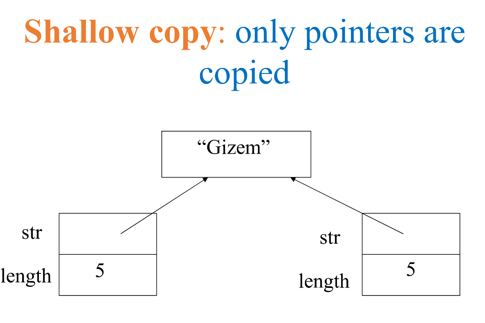
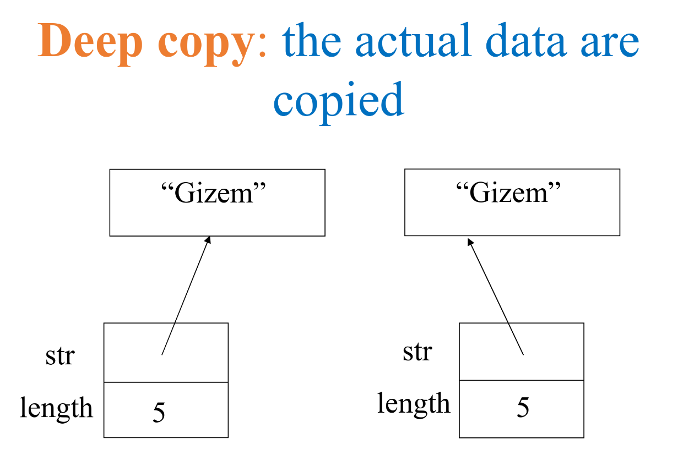

MIT License
Copyright (c) 2025 Emir Baha Yıldırım
Please see the LICENSE file for more details.

-------------------------------------------------------------------------------

# C++ Overview

## C++ Techniques

Relevant techniques include:
1. C++ classes, with *private* and *public* members.
2. Function and operator name *overloading* to give "natural" function calls.
3. *Templates* to allow the same code to be used on a variate of different data types.
4. A clean *built-in I/O interface*, which itself involves overloading the input and output operators.
Learning these techniques is much of what C++ is about.[^1]

-------------------------------------------------------------------------------

# Constructors

A *constructor* is a method that executes when an object of a class is declared
and sets the initial state of the new object. A constructor has
- the same name with the class,
- no return type,
- zero or more parameters (the constructor without an argument is called the
default constructor).

There may be more than one constructor defined for a class. Although it has a
more general meaning, this is called overloading.

If no constructor is explicitly defined, one that initializes the data members
using language defaultls is automatically generated.

## Same Example from W01.md

```cpp
// IntCell.h
// A class for simulating an integer memory cell

class IntCell
{
public:
    IntCell() {
        storedValue = 0
    }
    IntCell(int initialValue) {
        storedValue = initialValue
    }

    int read() {
        return storedValue;
    }
    void write(int x) {
        storedValue = x;
    }
private:
    int storedValue;
}
```

Let's try to use only a single constructor for the same job, so that it looks
less cluttered.
```cpp
class IntCell
{
public:
    IntCell(int initialValue = 0) : storedValue(initialValue)
    {
        // body of the constructor
    }
}
```
This is called a *member initializer list*. It's how you initialize the
data members (like `storedValue`) of a class **before** the body of the
constructor (`{}`) begins executing.

After the constructor's parameter list (`int initialValue = 0`), you put a
colon `:`. Then, for each member you want to initialize, you write the member's
name followed by parantheses containing the value you want to initialize it
with. In this case, `storedValue(initialValue)` means initialize the
`storedValue` meber with the value passed in `initialValue`. And yes, this is
not explained in the slides. You can learn more about them at
[cppreference.com](https://en.cppreference.com/w/cpp/language/initializer_list.html)

OK, now that we've gone from two constructors to one, let's continue with the
destructors.

-------------------------------------------------------------------------------

# Destructors

A *destructor* is the complement of a *constructor*. It performs termination
housekeeping before the system reclaims the object's memory. An **automatic
default destructor** is added to yourr class if no other destructor is defined.
The only action of the automatic default destructor is to call the default
destructor of all member objects.

## Automatic Default Destructor

A destructor should never be called directly, because it is called
automatically when an object goes out of scope. In other words, it's
automatically called when the object's memory is being reclaimed by the system:
- If the object is on the stack, when the function returns
- If the object is on the heap, when **delete** is used

## Custom Destructors

To add custom behavior to the end-of-life of the function, a custom destructor
can be defined. A custom destructor is a member function, just like a custom
constructor. It's name starts with a tilde (`~`) followed by the class name:
- `~IntCell();`
- `~Cube();`
It can't recieve no parameters, and can't return any values. You can only have
a single destructor per class.

A custom destructor is essential when an object allocates an external resource
tnhat must be closed or freed when the object is destroyed. Examples:
- Heap memory
- Open files

### Example

```cpp
class IntCell
{
public:
    IntCell(int initialValue=0) {
        storedValue = new int(initialValue);
    }
    ~IntCell() {
        delete storedValue;
    }
    
    int read() {
        return *storedValue;
    }
    void write(int x) {
        *storedValuet = x;
    }
private:
    int *storedValue;
}
```

-------------------------------------------------------------------------------

# Separation of Interface and Implementation

Large-scale projects put the interface and implementation of classes in
different files. For small-scale projects it may not matter.

- ***Header File:*** The *header file* contains the interface of a class.
Usually ends with `.h`.

- ***Source Code File:*** The *source code file* contains the implementation of
a class. Usually ends with `.cpp`. `.cpp` file includes the `.h` file with the
***preprocessor*** command `#include`.

## Example

### Header File

`IntCell` class interface in `IntCell.h`:
```cpp
// IntCell.h

#ifndef _IntCell_H_  // include guard, prevents multiple inclusions. stands for "if not defined"
#define _IntCell_H_  // define the macro _IntCell_H_,
// macro means a name replacement by the preprocessor before compilation
// if this file is included again, the code between #ifndef and #endif is skipped.
// the reason the macro starts with _ and ends with _H_ is to reduce the chance of name conflicts.
// it's just a convention, you can use any name you want. e.g. `intcellheader`
// but it's better to follow conventions.

// A class for simulating an integer memory cell
class IntCell
{
public:
    IntCell(int initialValue=0);
    int read() const;
    void write(int x);
private:
    int storedValue;
};
#endif
```

### Implementation File

`IntCell` class implementation in `IntCell.cpp`:
```cpp
// IntCell.cpp
#include <iostream>
#include "IntCell.h"

// construct the IntCell with initialValue
IntCell::IntCell(int initialValue) : storedValue(initialValue) {};

// return the stored value
int IntCell::read() const {
    return storedValue;
}

// store x
void IntCell::write(int x) {
    storedValue = x;
}
```
<details>
    <summary> What the hell `const` is doing there? </summary>

The reason we use the keyword `const` after the parameter list (but before
the body) of a member function is to signify that the function will not
modify the state of the object it is called on. It's technically not
necessary, but it ensures that the object's state cannot be modified.
For example, if you tried to write `storedValue = 99` inside the body of a
`const` function, the compiler would immediately produce an error. It's a
key safety measure, since `read()` is designed only to retrieve a value, using
`const` prevents accidental modifications to the cell's value.

Don't confuse this with `const int IntCell:read() { ... }`, because this
does not do the same job. `const` modifies the return type `int`. Meaning
that the value returned by the function cannot be modified by the caller.
The `const` keyword makes the stuff that comes *after* the keyword, not an
entire block.

So, although we are not actually modifying the state of the object inside the
method `read()`, it is good practice to add the keyword `const` anyway.
</details>

### A Client Program

A program that uses `IntCell` in file `TestIntCell.cpp`:
```cpp
// TestIntCell.cpp
#include <iostream>
#include "IntCell.h"

int main()
{
    IntCell m; // or IntCell m(0);

    m.write(5);
    std::cout << "Cell content: " << m.read() << std::endl;
}
```

-------------------------------------------------------------------------------

# Function Overloading

A function overload is not a single function. It's multiple function with the
same name, but different parameters. Overloaded functions should perform
similar tasks to avoid confusion. Function to square `int`s and function to
square `float`s can have the same name.
```cpp
int square(int x) { return x*x; }
float square(float x) { return x*x; }
```
Compiler chooses which function to use based on the actual given parameter
types:
```cpp
square(4);    // calls the integer version
square(4.0f); // calls the float version
```
Functions that only differ by return type cannot be overloaded:
```cpp
int square(int x) { ... };
float square(int x) { ... };
```
<details>
    <summary> Output of the Above Program </summary>

```bash
❯ test
Compiling...
testBench.cpp:5:7: error: ambiguating new declaration of ‘float square(int)’
    5 | float square(int x) { return x*x; };
      |       ^~~~~~
testBench.cpp:4:5: note: old declaration ‘int square(int)’
    4 | int square(int x) { return x*x; }
      |     ^~~~~~
```
We get a compile error even without calling one of the functions.
</details>

## Overloaded Operators

An operator with more than one meaning is said to be overloaded.
```cpp
2 + 3
3.1 + 3.2
// + is an overloaded operator because it work with more than a single data type
```
To enable a particular operator to operate correctly on different instances of
a class, we may define a new meaning for the operator. Thus, we may overload
it.

## Operator Overloading

Operator overloading allows us to use existing operators for user-defined
classes. The following operators can be overloaded:
```
~     !     =      <      >     new    delete
+     -     *      /      %     ^      &      |
+=    -=    *=     /=     %=    ^=     &=     |=
<<    >>    >>=    <<=    ==    !=     <=     >=
&&    ||    ++     --     ,     ->*    ->     ()    []
```

By overloading, we mean that, after overloading it, you can use the operator
(e.g. `+`) with the class *you* have created. If you've written a `Vector`
class and create a method that adds two `Vector`s, you don't have to create a
method called `add()`, because you can overload the `+` operator to do that.
```cpp
// assume `a`, `b`, and `c` are three objects of a vector class you've written
c = a + b
// instead of c = a.add(b), because the compiler will translate the above line
// to a function call like c = a.operator+(b) and you can still use the `+`
// operator as usual
```
You can write the function definition as normal, but the overloading function
should be named with the `operator` keyword followed by the symbol for the
operator being overloaded (e.g. `operator+`). Please note that you cannot
create new operators this way, so use only the existing operators.

About built-in types, this overloading ***only applies to user-defined
classes***, meaning that you ***cannot change the way an operator works with
the built-in types***. For example, you cannot how two `int` type objects are
added, but you can create a way to add two `Vector` objects from a class
`Vector` that you've created.

### Complex Class Example

`Complex` class interface in the file Complex.h:
```cpp
// Complex.h

#ifndef _Complex_H_
#define _Complex_H_

class Complex
{
    float re, im; // by default private

public:
    Complex(float x=0, float y=0) : re(x), im(y) {}
    Complex operator*(Complex rhs);
    float modulus();
    void print();
};

#endif
```

### Implementation of `Complex` Class

`Complex` class implementation in file Complex.cpp
```cpp
// Complex.cpp
#include <iostream>
#include <cmath>
#include "Complex.h"

Complex Complex::operator*(Complex rhs)
{
    Complex prod;
    prod.re = (re*rhs.re - im*rhs.im);
    prod.im = (re*rhs.im + im*rhs.re);
    return prod;
}
float Complex::modulus()
{
    return sqrt(re*re + im*im);
}
void Complex::print()
{
    std::cout << "(" << re << "," << im << ")" << std::endl;
}
```

### A Client Program Using the `Complex` Class

A program that uses `Complex` class in file TestComplex.cpp
```cpp
// TestComplex.cpp
#include <iostream>
#include "Complex.h"

int main()
{
    Complex c1, c2(1), c3(1,2);
    float x;

    // overloaded * operator
    c1 = c2 * c3 * c2;

    // x = sqrt(c1.re*c1.re + c1.im*c1.im);
    // Mistake: The compiler would stop here, since the `re` and `im` parts are private.

    // Now we use an authorized public function
    x = c1.modulus();

    c1.print();
}
```

### Multiplication of a `Complex` Object with a Scalar

We could also create a way to multiply a complex number with a scalar. Define
another function with the same name but different parameters.
```cpp
// Complex.h
class Complex
{
    ...

    Complex operator*(Complex rhs) const;
    Complex operator*(float k) const;

    ...
}
```
```cpp
// Complex.cpp
...

Complex Complex::operator*(Complex rhs) const
{
    Complex prod;
    prod.re = (re*rhs.re - im*rhs.im);
    prod.im = (re*rhs.im + im*rhs.re);
}

// overload it
Complex Complex::operator*(float k) const
{
    Complex prod;
    prod.re = re * k;
    prod.im = im * k;
    return prod;
}

...
```
```cpp
// TestComplex.cpp

#include <iostream>
#include "Complex.h"

int main()
{
    Complex c1, c2(1), c3(1,2);

    c1 = c2 * c3 * c2;
    c1.print();

    c1 = c1 * 5; // translated to c1.operator*(5);
    c1.print();

    // below line would give an error
    c1 = 5 * c1; // cannot translate to 5.operator*(c1);
}
```

### Putting the Scalar to the Left of the `Complex` Object

To support multiplying with a scalar on the left, we must define a new function
that is outside the class scope.

```cpp
Complex operator*(float k, Complex c) {
    Complex prod;
    prod.re = k * re; // Compile Error: cannot access `re`
    prod.im = k * im; // Compile Error: cannot access `im`
}
```
An outside function cannot access the private members of a class. We can solve 
this in two ways:

#### Solution 1 - Getter/Setter Functions

```cpp
// Complex.h
class Complex
{
    ...

public:
    void setReal(float x) { re = x; }
    void setImag(float x) { im = x; }
    float getReal() const { return re; }
    float getImag() const { return im; }

    ...
};
```
```cpp
// Complex.cpp
Complex operator*(float k, Complex c) {
    Complex prod;
    prod.setReal(k * c.getReal());
    prod.setImag(k * c.getImag());
    return prod;
}
```

#### Solution 2 - Friend Functions

A **friend function**, that is a **friend** of a given class, is a function
that is given the same access as methods to private and protects data.

Declare the outside function as the friend of this class. It can then access
the private members of the class.

```cpp
// Complex.h
class Complex
{
    ...

    friend Complex operator*(float k, Complex rhs);

    ...
};
```
```cpp
// Complex.cpp
Complex operator*(float k, Complex c) {
    Complex prod;
    prod.re = k * re; // now this line is ok, won't give a compile error
    prod.im = k * im; // now this line is ok, won't give a compile error
    return prod;
}
```
Note that the `friend` keyword is not used here. It is only used inside the
class.

### Friend Classes

A class may declare another class as a friend as well. In that case all member
functions of the "befriended" class can access the private members of its
friend class.
```cpp
class A
{
    ...
};

class B
{
    ...
    friend A;
};
```
Now, class `A` can access private members of class `B`, but **not** the other
way around.

-------------------------------------------------------------------------------

# `const` Keyword in C++

In C and C++ we use the keyword `const` to make program elements constants,
i.e., non-changing. `const` keyword can be used in many contexts in a C++
program. It can be used with
- variables,
- pointers,
- function arguments **and** return types,
- class data members,
- class member functions, and
- objects.

## Example Use Cases of Keyword `const`

We may encounter `const` in the following cases:

1. **`const` Reference Parameter**
```cpp
Complex operator*(const Complex& rhs);
```
In this case it means that the parameter cannot be modified in the function.

2. **`const` Member Function**
```cpp
Complex operator*(Complex& rhs) const;
```
In this case it means that the function cannot modify class members.

3. **`const` Object/Variable**
```cpp
const Complex c1(3,4);
```
In this case it means that the object cannot be modified.

## Pointers to a Constant Value, Constant Pointer to a Value, Constant Pointer to a Constant Value

### Pointers to a Constant Value

You can modify **what** object the pointer points to, but cannot change the
**value** of the object the pointer points to ***when accessed by p***.

```cpp
int i;

const int* p = &i; // read as `constant integer pointer p`

// Valid:
p = nullptr; // OK, can change what p points to
i = 6; // i can be changed if not accessed by p, because it's not constant

// Invalid:
*p = 6 // NOT OK, cannot change the value of the object p points to ***when accessed by p***
```

### Constant Pointer to a Value

You can modify the **value** of the object the pointer points to, but cannot
modify **what** the pointer points to.

```cpp
int i;
int j;

int* const p = &i; // read as `integer pointer constant p`

// Valid:
*p = 6; // OK

// Invalid:
p = &j // NOT OK, CANNOT change where p points to
```

### Constant Pointer to a Constant Value

You cannot modify the **value** of the object the pointer points to, and cannot
modify **what** the pointer points to, but you can change the **value** of the
object pointed by the pointer ***when not accessed by the pointer***.

```cpp
int i;

const int* const p = &i;

// Valid:
i = 6; // OK, int i is NOT **constant**.

// Invalid:
p = nullptr; // NOT OK, cannot change what p points to
*p = 6; // NOT OK, cannot change the value of the object pointed by p ***when accessed by p***
```

### Constant Pointer to a Constant Variable

You cannot modify the **value** of the object the pointer points to, and cannot
modify **what** the pointer points to, and you cannot change the **value** of
the object pointed by the pointer ***even when not accessed by the pointer***.

```cpp
const int i;

const int* const p = &i;

// Invalid:
p = nullptr; // NOT OK, cannot change what p points to
*p = 6; // NOT OK, cannot change the value of the object pointed by p
i = 6; // NOT OK, cannot change the value of i, because it's constant
```

## `const` Reference

A constant reference will not let you change the value it references.
```cpp
int n = 5;
const int& rn = n;

// Valid:
n = 10; // OK, n is not constant

// Invalid
rn = 6; // NOT OK, cannot change the value reference by rn
// don't forget that you cannot change a reference object's reference variable
// so `int& rn = i` would give an error even if `int i` is defined elsewhere
```
A constant reference is like a constant pointer to a constant value.

-------------------------------------------------------------------------------

# Parameter Passing

I've talked about this in the previous week's markdown, but let's reiterate.
Parameter passing is how arguments are passed to functions. There are three
main ways to pass parameters to functions in C++:

1. **Pass by Value:** A copy of the argument's value is made in memory and
passed to the function. Changes made to the parameter inside the function do
not affect the original argument. Not the way you should do it if you want to
change the value of the actual parameter at some point.
    - Copy of data passed to function, unnecessary use of memory.
    - Changes to copy do not change original, we're not coding in Python.
```cpp
// Example
int squareByValue(int x) {
    return x * x; // caller's argument not modified
}
```

2. **Pass by Pointer:** An older and messier way of passing parameters to
functions, but I think you should at least know how it's done. A pointer to the
argument's memory address is passed to the function. The function can then
dereference the pointer to access and modify the original argument.
    - Risky, messy, and hard to use. Go for it if you trust yourself.
    - Avoids a copy and allows changes to the original.
```cpp
// Example
void squareByPointer(int* px) {
    *px *= *px;
}
```

3. **Pass by Reference:** The standard of today. Cleaner and safer than using
pointers to pass parameters. Instead of passing a copy of the argument's value,
a reference (or alias) to the original argument is passed to the function.
Changes made to the parameter inside the function directly affect the original
argument. This is done using reference variables (using the `&` symbol in the
parameter list).
    - Safe, clean, and easy to use. Just use references.
    - Avoids a copy and allows changes to the original.
```cpp
// Example
void squareByReference(int& rx) {
    rx *= rx;
    // no need to return, it changes the value of x anyway
}
```

If you decide to use a reference to pass a parameter, but want to guarantee
that the actual parameter will not be changed, you can use a constant
reference.
```cpp
int squareByConstRef(const int& x) {
    return rx * rx; // rx *= rx; not allowed, explained above
}
```

-------------------------------------------------------------------------------

# Improving the `Complex` Class

```cpp
// Complex.h
#ifndef _Complex_H_
#define _Complex_H_

class Complex
{
    float re, im; // by default private

public:
    Complex(float x=0, float y=0) : re(x), im(y) {}
    Complex operator*(const Complex& rhs) const;
    float modulus() const;
    void print() const;
};

#endif
```

-------------------------------------------------------------------------------

# Copy Constructor

In C++, a copy constructor is a special type of constructor that is used to
make a copy of an existing object. C++ compilers provide a default automatic
copy constructor. The automatic copy constructor will copy the contents of all
member variables. Note that compiler provided copy constructor performs
*member-wise copying* of the elements of the class, i.e., shallow copy, meaning
that if the class contains pointer members, only the pointer values (memory
addresses) are copied, not the actual data being pointed to.

## Custom Copy Constructor

A custom copy constructor is:
- a class constructor
- has exactly one argument which must be a `const` reference of an object of
that class.

Example:
```cpp
/*
The following method is a copy constructor for the `Complex` class. Since it is
same as the compiler's default copy constructor for this class, it is actually
redundant.
*/

Complex::Complex(const Complex& C) {
    re = C.re;
    im = C.im;
}
```

Another Example:
```cpp
class MyString
{
public:
    MyString(const char* s = "");
    MyString(const MyString& s);
    ...
private:
    char* str;
    int length;
};

MyString::MyString(const MyString& s) {
    length = s.length;
    str = new char[length+1];
    strcpy(str, s.str);
}
```
This is a deep copy, meaning that the actual data being pointed to is copied,
not just the pointer values (memory addresses). Remember the compiler's default
copy constructor does a shallow copy.

- **Shallow Copy:** A shallow copy copies the **values of the members**,
meaning if a member is a pointer, only the memory address it holds is copied,
causing both the original annd the copy to point to the *same* dynamically
allocated data. Risky
<a href="../slides/w02.pdf">
    
</a>

- **Deep Copy:** A deep copy creates a **new, separate block of memory** for
any dynamically allocated resources and then copies the *content* of the
original resource into this new block, ensuring the original and the copy are
completely independent.
<a href="../slides/w02.pdf">
    
</a>

For a copy constructor to be a deep copy construcotr, it needs to do the
following tasks:
1. Dynamically allocate memory for data fo the calling object.
2. Copy the data values from the passed-in parameter into corresponding
locations in the new memory belonging to the calling object.

## Copy Constructor Invocation

Often copy constructors are invoked automatically.
- Passing an object as a parameter (by value).
- Returning an object from a functionn (by value).
- Initializing a new object.

## Calling the Copy Constructor

- Automatically Called:
```cpp
A x(y);  // where y is an object of class `A`.
f(x);    // a copy constructor is called for value parameters
x = g(); // a copy constructor is called for value returns

MyObject a;      // default constructor call
MyObject b(a);   // copy constructor call
MyObject bb = a; // identical to bb(a) : copy
MyObject c;      // default constructor call
c = a;           // assignment operator call, explained in the next section
```

-------------------------------------------------------------------------------

# Assignment Operator

If an assignment operator is not provided, the C++ compiler provides an
automatic assignment operator. The automatic assignment operator will copy the
contents of all member variables. Meaning that if your class has pointer
members they will be copied directly. Thus, a shallow copy. 

## Custom Assignment Operator

A custom assignment operator:
- is a public member method of the class,
- has the function name `operator=`,
- has a return value of a referrence of the class's type,
- has exactly one argument.
The argument must be `const` reference of the class's type.

```cpp
IntCell& operator=(const IntCell& obj)
```

## Deep vs. Shallow Assignment

Shallow assignment has the same kind of issues that happen in the copy
constructor. For shallow assignments, the default assignment operator is OK.
For deep assignments, you have to write your own *overloaded* assignment
operator (`operator=`). The copy constructor is not called when doing an
object-to-object assignment.

## `this` Pointer

Each class object has a pointer which automatically points to itself. The
pointer is identified by the keyword `this`. Another way to think of this is
that each member function has an implicit first parameter; that parameter is
`this`, the pointer to the object calling that function.

## `operator=` Overloading Example

```cpp
Complex& Complex::operator=(const Complex& rhs) {
    if (this != &rhs) {     // note the address of rhs
        this->re = rhs.re;  // correct but redundant, it means `re = rhs.re`
        this->im = rhs.im;
    }
    return *this;           // return the calling object, enables cascading
};
```

## Another Example

```cpp
MyString& MyString::operator=(const MyString& rhs) {
    if (this != &rhs) {
        delete[] this->str; // donate back, useless memory
        this->length = rhs.length;
        this->str = new char[this->length + 1]; // allocate new memory
        strcpy(this->str, rhs.str); // copy the characters
    }
    return *this; // return self-reference
}
```

## Copy Constructor and Assignment Operator
###     TODO : ADD EXPLANATION

Note that the copy constructor is called when a new object is being created.
The assignment operator is called when an existing object is assigned to a new
state.
```cpp
class MyObject
{
public:
    MyObject(); // default constructor
    MyObject(const MyObject& a); // copy constructor
    MyObject& operator=(const MyObject& a); // assignment operator
};
MyObject a;     // constructor called
MyObject b = a; // copy constructor called
b = a;          // assignment operator called
```

-------------------------------------------------------------------------------

# Destructor

For classes with pointer we also need to define a destructor to avoid memory
leaks.
```cpp
// MyString.h
class MyString
{
public:
    MyString(const char* s='');
    MyString(const MyString& s);
    ~MyString();
    MyString& operator=(const MyString& s);
    ...
private:
    int length;
    char* str;
};
```
```cpp
// MyString.cpp
...
MyString::~MyString(){
    delete[] str;
}
```

-------------------------------------------------------------------------------

# Rule of Three

Whenever you need to define
- a copy constructor,
- assignment operator, or
- the destructor
you must define all three of them, because you will definitely need the other
two. This is known as the ***rule of three***. In general, for every class that
contains pointer members, you must define all three functions (methods).

-------------------------------------------------------------------------------

# Templates

> A template is a C++ entity that defines one of the following:
> - a family of classes (class template), which may be nested classes
> - a family of functions (function template), which may be member functions
> - an alias to a family of types (alias template) (since C++11)
> - a family of variables (variable template) (since C++14)
> - a concept (constraints and concepts) (since C++20)
[Source: cppreference.com](https://www.en.cppreference.com/w/cpp/language/templates.html)

Templates allow us to write routines that work for arbitrary types without
having to know what these types will be. We'll only use two of those templates:
- Function Templates
- Class Templates

## Syntax of Templates

```cpp
template <parameter-list> declaration
```
- **Explanation**:

    - *parameter-list:* A non-empty, comma-separated list of the template
    parameters each of which is either constant parameter, a type parameter, a
    template parameter, or a parametre pack of any of those(since C++11).

    - *declaration:* Declaration of a class (including struct and union), a
    member class or member enumeration typpe, a variable or static member at
    class scope(since C++14), or an alias template(since C++11). It may also
    define a template specialization.

## Function Templates

A function template is ***not*** an actual function. Instead, it is a design
(or pattern) for a function. The compiler creates the acctual function based on
the actual types used in the program.

- **Syntax**
```cpp
template <parameter-list> function-declaration
```
- **Explanation:**

    - *function-declaration:* A function declaration. The function name
    declared becomes a template name.

    - *parameter-list:* A non-empty, comma-separated list of the template
    parameters each of which is either constant parameter, a type parameter, a
    template parameter, or a parametre pack of any of those(since C++11).

- **Example:**
```cpp
template <class T>
void swap(T &lhs, T &rhs)
{
    // swap function template
    T tmp = lhs;
    lhs = rhs;
    rhs = tmp;
}
```

### Using a Template Function

Instantiation of a template with a particular type, logically creates a new
function. Only one instantiation is created ffor each parameter-type
combination.

```cpp
#include <iostream>

int main()
{
    int x = 5, y = 7;
    double a = 2, b = 4;
    swap(x, y);
    swap(x, y);
    swap(a, b);

    std::cout << x << ' ' << y << std::endl;
    std::cout << a << ' ' << b << std::endl;

//  swap(x, b);   // NOT VALID: NO MATCH
}
```

## Class Templates

Class templates are used to define generic classes. It may be possible to use a
class that defines several operations on a collection of integres to manipulate
a collection of real numbers.

- **Syntax**
```cpp
template <parameter-list> class-declaration
```
- **Explanation:**

    - *class-declaration:* A class declaration. The class name declared becomes
    a template name.

    - *parameter-list:* A non-empty, comma-separated list of the template
    parameters each of which is either constant parameter, a type parameter, a
    template parameter, or a parametre pack of any of those(since C++11).

- **Example:**
```cpp
template <class T>
class TemplateTest
{
    // this class can use T as a generic type
public:
    void f(T a);
    T g();
    ...
private:
    T x, y, z;
    ...
}
```

### Implementation

Each member function must be declared as a template. All member functions must
be implemented in the **header file**, so that the compiler can find their
definition and replace `T` with the actual parameter type.

```cpp
// typical member implementation
template <class T>
void TemplateTest<T>::f(T a) {
    // member body
}
```

### Object Declarations Using Template Classes

- **Form**
```cpp
class-name<type> object-name;
```

- **Interpretation**
`type` may be any defined data type `class-name` is the name of a template
class. The object `object-name` is created when the arguments specified between
`<>` replace their corresponding parameters in the template class.

### Example

```cpp
// MemoryCell.h
// memory cell interface

template <class T>
class MemoryCell
{
public:
    MemoryCell(const T& initVal = T());
    const T& read() const;
    void write(const T& x);

private:
    T storedValue;
}
```
```cpp
// MemoryCell.cpp
// implementation of class memebrs as template functions

template <class T>
MemoryCell<T>::MemoryCell(const T& initVal) : storedValue(initVal) {}

template <class T>
const T& MemoryCell<T>::read() const {
    return storedValue;
}

template <class T>
void MemoryCell<T>::write(const T& x) {
    storedValue = x;
}
```
```cpp
// MemoryCellTest.cpp
// a simple test routine

int main()
{
    MemoryCell<int> m;   // instantiate int version
    MemoryCell<float> f; // instantiate float version
    MemoryCell<int> m2;   // use the previously created class

    m.write(5);
    m2.write(6);
    f.write(3.5);
    std::cout << "Cell content: " << m.read() << std::endl;
    std::cout << "Cell content: " << m2.read() << std::endl;
    std::cout << "Cell content: " << f.read() << std::endl;
}
```

-------------------------------------------------------------------------------

# Error Handling in C/C++

In  C, errors are reported by returning error codes from functions.
```c
int read(const char* filename, char data[]) {
    FILE* fp = fopen(filename, 'r');
    if (fp == NULL) {
        return -1; // indicate error
    }
    // read file contents into data
    ...
}
```

In C++, however, we have a more advanced mechanism called **exceptions**. It
uses three keywords: **throw, catch, try**. The function that encounters an
error throws an exception.
```cpp
int read(const char* filename, char data[]) {
    FILE* fp = fopen(filename, 'r');
    if (fp == NULL) {
        throw "ERR: Cannot open file";
    }
    // otherwise read file contents into data
    ...
}
```

This exception must be caught, otherwise the program will abnormally terminate.
```cpp
#include <iostream>

int main()
{
    char data[128];
    try {
        read('test.txt', data);
        ... // possible some other code
    }
    catch(const char* error) {
        // if `read` function throws an exception, program will continue
        // executing from here
        std::cout << "ERR: " << error << std::endl;
    }
}
```

Note that we throw an *object* or a *variable*, and we catch an *object* or a
*variable*. These types should match for the exception to be caught. In the
previous example, we threw a `const char*` and caught a `const char*`, so it
was correct.

## Example

We can also throw an object of a user defined class.
```cpp
class FileReadError
{
    ...
};

int read(const char* filename, char data[]) {
    FILE* fp = fopen(filename, 'r');
    if (fp == NULL) {
        throw FileReadError(); // indicate error
    }
    // read file contents into data
    ...
}
```
Then we must update the catch code as well.
```cpp
int main()
{
    char data[128];
    try {
        read('test.txt', data);
    }
    catch(FileReadError error) {
        // if read throws an exception
        // the program will continue from here
    }
}
```

There are many details of exception handling, but in this course, you should
only know that the destructors of local objects will be called when an
exception is thrown.
```cpp
class A
{
public:
    ~A() {std::cout << "Destructor called." << std::endl;}
};

int read(const char* filename, char data[]) {
    A a;
    FILE* fp = fopen(filename, 'r');
    if (fp == NULL) {
        throw "ERR: Cannot open file."; // a's destructor will be called
    }
}
```

-------------------------------------------------------------------------------

# Standard Template Library (STL)

It includes:
- I/O Facilities: `iostream`
- Garbage-Collcted `string` Class
- Containers: `vector`, `list`, `queue`, `stack`, `map`, `set`
- Numerical: `complex`
- General Algorithms: `search`, `sort`

-------------------------------------------------------------------------------

# `vector`

- **Vector:** Dynamically growing and shriking array of elements.
- **Usage:** Include `vector` header.
```cpp
#include <vector>

int main()
{
    vector<int> a(4); // a vector called a, containing 4 integers
    vector<int> b(4, 3); // a vector called b, containing 4 integers, each initialized to 3
    vector<int> c; // 0 int objects
}
```

The elements of an integer vector behave just like ordinary integer variables.
```cpp
a[2] = 45;
```

## Manipulating `vector`s

- **The `size()` Member Function:** Returns the number of elements in the
vector. `a.size()` returns 4.
- **The `operator=`:** Can be used to assign one vector to another.
```cpp
v1 = v2 // as long as they are vectors of the same type
```
- **The `push_back()` Member Function:** Allows you to add elements to the end
of a vector
- **The `pop_back()` Member Function:** Allows you to add elements to the end
of a vector

-------------------------------------------------------------------------------

### Notes

#### Footnote 1

Not exactly. I believe this statement is incomplete, because C++ is not
just about classes or overloading. It's more about system programming,
performance, and zero-overhead abstraction. By zero-overhead abstraction we
mean, you can use high-level, elegant features (like classes and templates)
**without sacrificing performance or control** of low-level languages like C.
C++ is a multi-paradigm language, meaning that it's not just an Object-Oriented
language. It fully supports at least four major programming paradigms:
- Procedural Programming (just like C, and the way you've learned to write up
until this point)
- Object-Orient Programming (the way you're learning right now, using classes
and inheritance)
- Generic Programming (using templates and the Standard Template Library, STL)
- Functional Programming (with features like lambda, which you should learn how
to use)

C++ allows us to implement complex algorithms and data structures in a way that
is closest to the machine, letting us analyze their true time and space
complexity without language overhead. Features like pointers give us precise
control over memory allocation, which is incredibly important to building
efficient data structures like graphs and hash tables from scratch. So, saying
that C++ is just about classes or overloading absurdly underestimates the power
of C++. Thank you for listening my TED Talk.

[^1]: Please see [Footnote 1](#footnote-1)
