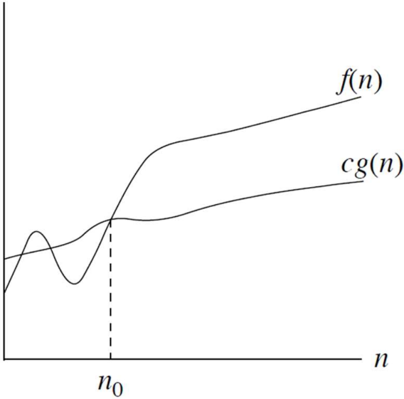
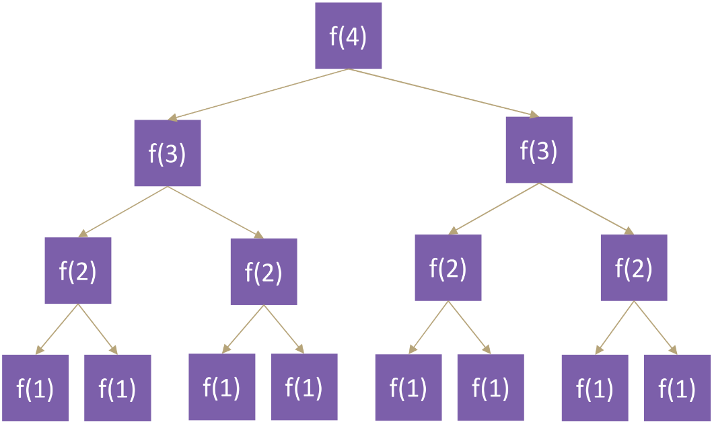

MIT License
Copyright (c) 2025 Emir Baha Yıldırım
Please see the LICENSE file for more details.

> [!NOTE]
> This is the point where the course actually starts. I will have to use LaTeX
> and graphs to actually create good and legible lecture notes, so it may or may
> not take more than the usual rate.

-------------------------------------------------------------------------------

# Algorithm Analysis

## Algorithm

- An *algorithm* is a set of definite instructions to be followed to solve a
problem.
    - There can be more than one solution (algorithm) to solve a given problem.
    - An algorithm can be implemented using different programming languages on
    different platforms.

- An algorithm must be *correct*, meaning that it should solve the problem.
    - For example, a sorting algorithm should solve the problem correctly even
    if the the input is already sorted, or it contains repeated elements. It
    should correctly output the sorted version of the input without raising
    errors.

## Algorithmic Performance

There are **2** aspects of algorithmic performance.
1. **Time:** Instructions take time.
    - How fast does the algorithm perform?
    - What affects its runtime?
2. **Space:** Data structures take space.
    - What kind of data structures can be used?
    - How does choice of data structure affect the runtime?

> [!NOTE]
> **Runtime:** the amount of time the algorithm takes to complete its execution

We will mostly focus on time. Thus learning how to estimate the time required
for an algorithm and how to reduce that time.

## Analysis of Algorithms

When we analyze algorithms, we employ mathematical techniques that analyze
algorithms independent of *specific implementations*, *computers*, or *data*.

To analyze algorithms, we first start to count the number of significant
operations in a particular solution to assess its efficiency, then, we will
express the efficiency of algorithms using growth functions.

## The Running Time of Algorithms

Each instruction (operation) in an algorithm (program) has a cost, because each
operation takes a certain time, whether it's being run on an old
[Intel 8086](https://en.wikipedia.org/wiki/Intel_8086), or a top-of-the-line
[AMD Ryzen 9950X3D](https://en.wikipedia.org/wiki/AMD_Ryzen_9950X3D). Although,
it will be vastly different lengths of time, it will grow just the same. We'll
see what I mean in a few sections.
```cpp
count = count + 1; // takes a certain amount of time on both cpus, but is constant
```
A sequence of operations:
```cpp
count = count + 1; // Cost: c1
sum = sum + count; // Cost: c2
```
Total cost of the above program would be $`c_1 + c_2`$, independent of what
$`c_1`$ or $`c_2`$ actually is.

## Runtime Analysis

Runtime analysis is the process of determining the amount of time an algorithm
takes to complete as a function of the length of the input.
```cpp
// Example: Simple If-Statement
                   // Cost    Times
if (n < 0) {       //  c1       1
    absval = -n;   //  c2       1
}
else {
    absval = n;    //  c3       1
}
```
$`c_T \le c_1 + max(c_2, c_3)`$

```cpp
// Example: Simple Loop
                      // Cost    Times
int i = 1;            //  c1       1
int sum = 0;          //  c2       1
while (i <= n) {      //  c3      n+1
    i = i + 1;        //  c4       n
    sum = sum + 1;    //  c5       n
}
```
$`c_T = c_1 + c_2 + (n+1).c_3 + n.c_4 + n.c_5`$

Thus, the time required for this algorithm is proportional to $`n`$. So, even
if the 8086 takes `10` times longer to execute each instruction than the Ryzen,
both will have their runtimes grow linearly with $`n`$.

```cpp
// Example: Nested Loop
                          // Cost    Times
int i = 1;                //  c1       1
int sum = 0;              //  c2       1
while (i <= n) {          //  c3      n+1
    int j = 1;            //  c4       n
    while (j <= n) {      //  c5    n*(n+1)
        sum = sum + i;    //  c6      n*n
        j = j + 1;        //  c7      n*n
    }
    i = i + 1;            //  c8       n
}
```
$`c_T = c_1 + c_2 + (n+1).c_3 + n.c_4 + n.(n+1).c_5 + n.n.c_6 + n.n.c_7 + n.c_8`$
$`c_T = c_1 + c_2 + (n+1).c_3 + n.c_4 + n.(n+1).c_5 + {n^2}.c_6 + {n^2}.c_7 + n.c_8`$

Thus, the time required for this algorithm is proportional to $`n^2`$.

## Example: Nested Loop

**Problem:** Given $`n`$ numbers in an array `A`, calculate the sum of all
distinct pairwise multiplications.
```cpp
// A is an array of integers of size n
double sum = 0.0;
for (int i = 0; i < n; i++) {
    for (int j = i; j < n; j++) {
        sum += A[i] * A[j];
    }
}
```
$`\sum_{i=0}^{n-1} (n - i) = n + (n-1) + (n-2) + ... + 1 = \frac{n(n+1)}{2}`$

Thus, the time required for this algorithm is proportional to $`n^2`$.

## Exercise

Which of these loops take constant time regardless of the value of $`n`$?
1) `for (i=n/10; i<n; i++) sum+=i;`
2) `for (i=0; i<n; i+=n/10) sum++;`
3) `for (i=n; i<2*n; i++) sum--;`
4) `for (i=0; i<n; i+=10) sum++;`
5) `for (i=0; i<n/10; i+=10) sum*=2;`

<details>
    <summary> Solution </summary>

Answer: **2.**

*1.* Would grow linearly with $`n`$, because $`i`$ starts at $`\frac{n}{10}`$
but grows by $`1`$ at every iteration. If $`n`$ were $`10`$ times bigger, the
algorithm would take $`10`$ times longer.

**2.** Would always take up to $`10`$ steps, because $`i`$ starts at $`0`$, but
grows by $`\frac{n}{10}`$ at every iteration, so even if $`n`$ was $`10`$ times
bigger, the algorithm would still take $`10`$ steps.

*3.* Again, would grow linearly, because $`n`$ could be $`10`$ times bigger and
$`i`$ still grows by $`1`$ at every iteration.

*4.* This option would grow linearly, too, because although we're now
incrementing $`i`$ by $`10`$ at every step, if $`n`$ was $`10`$ times bigger,
it would take us $`10`$ times more time.

*5.* Same thing as option 4.
</details>

## Algorithm Growth Rates

- We measure an algorithm's time requirement as a function of the *problem size*.
    - Problem size depends on the application. (E.g. number of elements in a
    list for a sorting algorithm, number of disks for towers of Hanoi, etc.)
- The most important thing to learn is how quickly the algorithm's time
requirement grows as a function of the problem size.
    - Algorithm `A` requires time, proportional to $`n^2`$.
    - Algorithm `B` requires time, proportional to $`n`$.
- An algorithm's proportional time requirement is known as ***growth rate***.
- We can compare the efficiency of two algorithms by comparing their growth
rates.

### Time Requirements as a Function of the Problem Size $`n`$
<a href="../slides/w03.pdf">
    
</a>

This is a graph showing the time requirements of two different algorithms as a
function of the problem size $`n`$. As you can see, for small inputs,
Algorithm A (exponential) is faster than Algorithm B (linear), but as the input
size increases, Algorithm B becomes faster and faster compared to Algorithm A.

### Running Times for Small Inputs of Different Functions
<a href="../slides/w03.pdf">
    
</a>

This is a graph showing the runtimes of the most common growth rates for small
inputs. As you can see, for small inputs, the differences between the growth
rates aren't that big, but as the input size increases, the differences become
more and more apparent.

### Running Times for Large Inputs of Different Functions
<a href="../slides/w03.pdf">
    
</a>

This is a graph showing the runtimes of the most common growth rates for large
inputs. As you can see, the differences between the growth rates become very
apparent as the input size increases.

## Big-O Notation

The Big-O notation is a mathematical notation that describes the *limiting*
behavior of a function when the argument tends towards a particular value or
infinity. We use Big-O notation to describe the computation time
(**complexity**) of algorithms using algebraic terms. `O` stands for `order`,
as in `order of magnitude`.

### Formal Definition

$`O(g(n)) = \{f(n) \text{: there exist positive constants } c \text{ and } n_0 \text{ such that } 0 \le f(n) \le c.g(n) \text{ for all } n \ge n_0\}`$
<a href="../slides/w03.pdf">
    
</a>

$`g(n) \text{ is an \textit{asymptotic upper bound} for } f(n). \text{If } f(n) \in O(g(n)) \text{, we write } f(n) = O(g(n))`$

### Big-O Example

If an algorithm requires $`2n^2 - 3n + 10`$ seconds to solve a problem size 
$`n`$ and constants $`c \text{ and } n_0`$ exist such that.
```math
\begin{equation}
2n^2 - 3n + 10 \le cn^2 \text{ for all } n \ge n_0
\end{equation}
```
In fact, for $`c = 3`$ and $`n_0 = 3`$:
```math
\begin{equation}
2n^2 - 3n + 10 \le 3n^2 \text{ for all } n \ge 3
\end{equation}
```
Thus, we say that the algorithm requires no more than $`3n^2`$ steps for
$`n \ge 3`$, so it is $`O(n^2)`$.
- The fastest growing term is $`2n^2`$.
- The constant $`2`$ can be ignored.

### Order of Terms

If we graph $`0.0001n^2`$ against $`10000n`$, the linear term would be larger
for a long time, but the quadratic one would eventually catch up (here at
$`n = 10^8`$).

From calculus we know that:
```math
\begin{equation}
\lim_{n\to\infty} \frac{10000n}{0.00001n^2} = \lim_{n\to\infty} \frac{10^8}{n} = 0
\end{equation}
```

As you can see, any quadratic (with a positive leading coefficient) will
eventually beat any linear. So the linear term in a quadratic function
eventually doesn't matter.

Consider the function $`n^4 + 100n^2 + 500 = O(n^4)`$
| $`n`$  | $`n^4`$           | $`100n^2`$   | $`500`$ | $`f(n)`$          |
|:-------|:------------------|:-------------|:--------|:------------------|
| 1      | 1                 | 100          | 500     | 601               |
| 10     | 10,000            | 10,000       | 500     | 20,500            |
| 100    | 100,000,000       | 1,000,000    | 500     | 101,000,500       |
| 1,000  | 1,000,000,000,000 | 100,000,000  | 500     | 1,000,100,000,500 |

The growth of a polynomial in $`n`$ as $`n`$ increases, depends primarily on
the degree (the highest order term), and not on the leading constant or the
low-order terms.

### Big-O Summary

- Write down the cost function, i.e., number of instructions in terms of the
problem size $`n`$.
    - Specifically, focus on the loops and find out how many iterations the
    loops run.
- Find the highest order term.
- Ignore the constant scaling factor.
- Now, you have a Big-O notation.

### Common Growth Rates

| Function     | Growth Rate Name          |
|:-------------|--------------------------:|
| $`c`$        | Constant                  |
| $`log(n)`$   | Logarithmic               |
| $`log^2(n)`$ | Log-squared               |
| $`n`$        | Linear                    |
| $`n.log(n)`$ | Log-linear (Linearithmic) |
| $`n^2`$      | Quadratic                 |
| $`n^3`$      | Cubic                     |
| $`2^n`$      | Exponential               |

### Growth Rate Functions

If an algorithm takes $`1 \text{ second}`$ to run with the problem size $`8`$,
what is the time requirement (approximately) for that algorithm with the
problem size $`16`$?
If its order is:

```math
\begin{align*}
O(1) &\rightarrow T(n) = 1 \text{ second} \\
O(\log_2{n}) &\rightarrow T(n) = \frac{1\times\log_2(16)}{\log_2{8}} = \frac{4}{3} \text{ seconds} \\
O(n) &\rightarrow T(n) = \frac{1\times 16}{8} = 2 \text{ seconds} \\
O(n\times\log_2{n}) &\rightarrow T(n) = \frac{1\times 16\times\log_2{16}}{8\times\log_2{8}} = \frac{8}{3}\ \text{ seconds} \\
O(n^2) &\rightarrow T(n) = \frac{1\times 16^2}{8^2} = 4 \text{ seconds} \\
O(n^3) &\rightarrow T(n) = \frac{1\times 16^3}{8^3} = 8 \text{ seconds} \\
O(2^n) &\rightarrow T(n) = \frac{1\times 2^{16}}{2^8} = 2^8 \text{ seconds}\ (= 256 \text{ seconds})
\end{align*}
```
<!-- I couldn't find a better solution for this. If you know a better solution, open up a PR, please. -->

### Logarithmic Cost $`O(\log{n})`$

```cpp
for(int i = 1; i < n; i*=2) { ... }  // base 2
for(int i = 1; i < n; i<<=1) { ... } // base 2
for(int i = n; i > 0; i/=3) { ... }  // base 3
for(int i = n; i > 0; i>>=2) { ... } // base 4
```
The base doesn't matter, because:

$`O(\log_2{n}) = \frac{O(\ln{n})}{O(\ln{2})} = O(\ln{n})`$

$`\text{Change of Base} \rightarrow \text{Base } e \text{ natural log}`$

So, we can say that $`O(\log{n})`$ without specifying the base.

### Motivation for Other Asymptotic Bounds

```markdown
Algorithm **foo**
    **for** i=1 to n do
        **for** j=1 to n do
            do something...
        end for
    end for
```
Runtime is $`O(n^3)`$
<!-- I know it should actually be O(n^2), but the slides say O(n^3), because O(n^3) is also an upper bound for that algorithm, even though it isn't the tightest. -->
```markdown
Algorithm **bar**
    **for** i=1 to n do
        **for** j=1 to n do
            **for** k=1 to n do
                do something else...
            end for
        end for
    end for
```
Runtime is $`O(n^3)`$
- Conclusion: **foo** and **bar** have the same asymptotic runtime. What is
wrong? could algorithm **bar** be better? $`O(n^2) \text{ or } O(n)`$?

## Big-Omega ($`\Omega`$) Notation
$`\Omega(g(n)) = \{f(n) \text{: there exist positive constants } c \text{ and } n_0 \text{ such that } 0 \le cg(n) \le f(n) \text{ for all } n \ge n_0\}`$
<a href="../slides/w03.pdf">
    
</a>

$`g(n) \text{ is an \textit{asymptotic lower bound} for } f(n).`$

- **Example:** $`\sqrt{n} = \Omega(\log{n}) \text{, with } c = 1 \text{ and } n_0 = 16.`$

## Big-Theta ($`\Theta`$) Notation
$`\Theta(g(n)) = \{f(n) \text{: there exist positive constants } c_1, c_2 \text{, and } n_0
\text{ such that } 0 \le c_1\times g(n) \le f(n) \le c_2\times g(n) \text{ for all } n \ge n_0\}`$
<a href="../slides/w03.pdf">
    
</a>

$`g(n) \text{ is an \textit{asymptotically tight bound} for } f(n).`$

- **Example:** $`\frac{n^2}{2}-2n = \Theta(n^2), \text{ with } c_1 = \frac{1}{4}, c_2 = \frac{1}{2} \text{, and } n_0 = 8.`$

-------------------------------------------------------------------------------

# What to Analyze?

An algorithm can require different times to solve different problems of the
same size. For example, searching an item in an array of $`n`$ elements using
sequential search would grow linearly:
$`\text{Cost: } \rightarrow 1, 2, 3, ..., n`$

- *Worst-Case Analysis:* The <ins>**maximum**</ins> amount of time that an
algorithm requires to solve a problem size of $`n`$.
    - This gives an upper bound for the time complexity of an algorithm.
    - Normally, we try to find worst-case behavior of an algorithm.

- *Best-Case Analysis:* The <ins>**minimum**</ins> amount of time that an
algorithm requires to solve a problem of size $`n`$.
    - The best case behavior of an algorithm is *not* so useful.

- *Average-Case Analysis:* The <ins>**average**</ins> amount of time that an
algorithm requires to solve a problem of size $`n`$.
    - Sometimes, it can be difficult to find the average-case behavior of an
    algorithm.
    - We have to look at all possible data organizations of a given size $`n`$,
    and their distribution probabilities of these organizations.
    - ***Worst-case analysis is more common than average-case analysis.***

-------------------------------------------------------------------------------

# Comparison of Two Search Algorithms

## Sequential Search

Sequential search algorithm searches for an item in an array by checking each
element one by one until it finds the item or reaches the end of the array.

```cpp
int sequentialSearch(const int a[], int item, int n) {
    for (int i= 0; i < n && a[i] != item; i++);

    if (i == n) {
        return -1;
    }
    return i;
}
```
- *Unsuccessful Search:* $`O(n)`$
- *Successful Search:*
    - **Best-Case:** *item* is in the first location of the array $`\rightarrow O(1)`$

    - **Worst-Case:** *item* is in the last location of the array $`\rightarrow O(n)`$

    - **Average-Case:** The number of key comparisons $`1, 2, 3, ... , n \rightarrow \frac{1}{n}\sum_{i=1}^{n} i = \frac{1}{n}\frac{n^2 + n}{2} \rightarrow O(n)`$

## Binary Search

Binary search algorithm searches for an item in a sorted array by repeatedly
dividing the search interval in half. If the value of the search key is less
than the item in the middle of the interval, narrow the interval to the lower
half. Otherwise, narrow it to the upper half. Repeatedly check until the item
is found or the interval is empty.

```cpp
int binarySearch(int a[], int size, int x) {
    int lo = 0;
    int hi = size - 1;
    int mi; // mid will be the index of target when found

    while (lo <= hi) {
        mi = (lo + hi)/2;
        if (a[mi] < x) {
            lo = mi + 1;
        }
        else if (a[mi] > x) {
            hi = mi - 1;
        }
        else {
            return mi;
        }
    }
    return -1;
}
```
- *Unsuccessful Search:* $`\text{Number of Iterations} = \lfloor\log_2{n}\rfloor + 1 \rightarrow O(\log_2{n})`$
- *Successful Search:*
    - **Best-Case:** Number of iterations is $`1 \rightarrow O(1)`$

    - **Worst-Case:**  Number of iterations is $`\lfloor\log_2{n}\rfloor + 1 \rightarrow O(\log_2{n})`$

    - **Average-Case:** $`\text{The average number of iterations} \le \log_2{n} \rightarrow O(\log_2{n}) `$

```0  1  2  3  4  5  6  7```  $`\leftarrow \text{ an array with size } 8`$

```3  2  3  1  3  2  3  4```  $`\leftarrow \text{ number of iterations}`$

$`\text{Average Number of Iterations} = \frac{21}{8} \le \log_2{8}`$

## How much better is $`O(\log_2{n})`$

| $`n`$                | $`O(\log_2{n})`$ |
|:---------------------|------------------:
| 16                   |                4 |
| 64                   |                6 |
| 256                  |                8 |
| 1046 (1 KiB)         |               10 |
| 16,384               |               14 |
| 131,072              |               17 |
| 262,144              |               18 |
| 524,288              |               19 |
| 1,048,576 (1MiB)     |               20 |
| 1,073,741,824 (1GiB) |               30 |

As you can see from the table, even for very large inputs, the number of
iterations required for binary search remains quite small.

-------------------------------------------------------------------------------

# Recaps

## Recap: Algorithm Analysis

- Runtime analysis should be:
    - Independent of the **platform**.
    - Independent of the **programmer's skill**.
    - Independent of **specific test cases** (content and size)
    - **Theoretically rigorous**

## Recap: So what do we do?

- **Theoretical analysis of algorithms** is used to estimate the runtime of an
algorithm as a function of the size of the input.
- this runtime is given in terms of the number of **primitive operations**
required, e.g., arithmetic operations.

## Recap: Big-O Notation

$`f(x) = O(g(x)) \text{Important: } O(g(x) \text{ is actually a set!})`$
- There exists:
    - some positive constant $`c`$.
    - some minimum $`x`$ value $`x_0`$
- Such that for all $`x \ge x_0`$
    - $`f(x) \le c \times g(x)`$

[!IMPORTANT]
When we say $`f(x) = O(g(x))`$, we are actually saying that $`f(x) \in O(g(x))`$.

## Recap: Estimating Running Time

```cpp
int sumArray(const vector<int> &arr) {
    int tot_sum = 0;
    int tot_prod_sum = 0;

    for (int i = 0; i < arr.size(); ++i) {
        tot_sum += arr[i];
    }

    for (int i = 0; i < arr.size(); ++i) {
        for (int j = 0; j < arr.size(); ++j) {
            tot_prod_sum += arr[i] * arr[j];
        }
    }
    return tot_sum + tot_prod_sum;
}
```

-------------------------------------------------------------------------------

# Modeling Complex Loops

```cpp
for (int i = 0; i < n; i++) {      // n
    for (int j = 0; j < i; j++) {  // 0 + 1 + 2 + 3 + ... + i-1
        std::cout << "Hello!";
    }
    std::cout << std::endl;
}
```
$`T(n) = 0 + 1 + 2 + 3 + ... + (i-1)`$

$`T(n) = \sum_{i=0}^{n-1} {\sum_{j=0}^{i-1} 1} \text{ What is the Big-O?}`$

$`T(n) = \sum_{i=0}^{n-1}{\sum_{j=0}^{i-1} 1} = \sum_{i=0}^{n-1} 1\cdot i = 1\cdot\sum_{i=0}^{n-1} = \frac{n(n-1)}{2} = \frac{1}{2}n^2 - \frac{1}{2}n = O(n^2)`$

-------------------------------------------------------------------------------

# Some Running Time Functions that Computer Scientists Like

- Polynomial : $`O(n^4)`$, $`O(n^2)`$
- Logarithmic : $`O(\log{n})`$, $`O(\log{\log{n}})`$
- Quasi-linear : $`O(n\cdot\log{n})`$ **fairly common**
- Sublinear : $`O(n^(\frac{1}{2}))`$
- Exponential : $`O(2^n)`$ **very bady! Often indicates something that is
basically brute force.**

-------------------------------------------------------------------------------

# Analysis of Recursive Functions

## Recursive Functions

A **recursive function** is a function that calls itself in order to solve a
problem. For example, here is a simple recursive function that calculates the
power of a number. Is it a correct algorithm? No, because it doesn't handle
negative numbers. Is the function returning an integer makes it wrong? No,
because you can overload the function to return floats or doubles as well,
easily.

```cpp
int naivePower(int x, int n) {
    if (n == 0) {
        return 1;
    }
    else {
        return (x * naivePower(x, n-1));
    }
}
```
How can we write the runtime of this algorithm?

### Recursive Relations

> [!NOTE]
> A **recurrence relation** is an equation that recursively defines a
> function's values in terms of earlier values.
> Very useful for analyzing an algorithm's running time.

### Recurrence Relations for `naivePower` Algorithm

<!-- Don't forget to explain each line. -->

$`T(0) = c_1`$
If $`n = 0`$, we just return $`1`$, which takes constant time $`c_1`$.

$`T(n) = c_2 + T(n-1)`$
If $`n > 0`$, we do a multiplication (cost $`c_2`$) and then call
$`naivePower(x, n-1)`$ (cost $`T(n-1)`$), but we don't know what $`T(n-1)`$ is.

$`\text{If only we had an expression for } T(n-1) \text{...}`$

```math
\begin{align*}
T(n) &= c_2 + (c_2 + T(n-2)) \\
     &= c_2 + (c_2 + (c_2 + T(n-3))) \\
     &= c_2 + (c_2 + (c_2 + (c_2 + T(n-4)))) \\
     &... \\
     &= k\cdot c_2 + T(n-k)
\end{align*}
```
$`\text{After } n \text{ expansions: } n\cdot c_2 + T(0) = n\cdot c_2 + c_1 \rightarrow O(n)`$

## Another Example

```cpp
int betterPower(int x, int n) {
    if (n == 0) {
        return 1;
    }
    else if (n == 1) {
        return x;
    }
    else {
        return betterPower(x*x, n/2);
    }
}
```
For simplicity, assume that $`n`$ is a power of $`2`$.

If only we had an expression for $`T(\frac{n}{2})`$...

$`T(0) = c_1, T(1) = c_2, ..., T(n) = c_3 + T(\frac{n}{2})`$

Expanded:
```math
\begin{align*}
                           T(n)&= c_3 + T(\frac{n}{2})\\
                               &= c_3 + c_3 + T(\frac{n}{4}) \\
                               &= c_3 + c_3 + c_3 + T(\frac{n}{8}) \\
                               &... \\
                               &= k\cdot c_3 + T(\frac{n}{2^k}) \\
     \text{What order should} &k \text{ be in order for us to get down to } T(1) \text{?} \\
          2^k = n\text{, so } k&= \log{n} \\
                               &= c_3 + \log{n} \\
                               &\rightarrow O(\log{n})
\end{align*}
```

## Recursive Patterns

- Modeling and analyzing recursive code is all about finding patterns in how
the input changes between calls and how much work is done within each call.
- <ins>Some</ins> of the more common recursive patterns:
    - **Pattern #1:** Halving the Input
        - e.g. Binary Search, betterPower
    - **Pattern #2:** Constant size input and doing work
        - e.g. Merge Sort (we will study this algorithm later)
    - **Pattern #3:** Doubling the Input
        - e.g. Computing Fibonacci

## Recursive Binary Search

```cpp
int binarySearch(const vector<int>& arr, int target, int left, int right) {
    if (left > right) {
        return -1;
    }

    int mid = (left - right)/2;

    if (arr[mid] == target) {
        return mid;
    }
    else if (arr[mid] > target) {
        return binarySearch(arr, target, left, mid-1);
    }
    else {
        return binarySearch(arr, target, mid+1, right);
    }
}
```

## Calculating Fibonacci

```cpp
int Fib(int n) {
    if (n <= 1) return 1;
    if (n == 2) return 1;
    return Fib(n-2) + Fib(n-1);
}
```

- Each call creates 2 more calls.
- Each new call has a copy of the input.
- Almost doubling the input at each call

Thus, $`\rightarrow`$ **Pattern #3** (Almost) Doubling the Input
<a href="../slides/w03.pdf">
    
</a>

### Recurrence Relation for `Fib()`

```math
`T(n) = 
    \begin{cases}
        c_1, & \text{if } n \le 1 \\
        2\cdot T(n-1) + c & \text{otherwise}
    \end{cases}
```

### Solving the Recurrence

```math
\begin{align*}
T(n)&=2\cdot T(n-1) + c \\
    &=2\cdot (2\cdot T(n-2) + c) + c \\
    &=2\cdot (2\cdot (2\cdot T(n-3) + c) + c) + c \\
    &=2^3 \cdot T(n-3) + (2^2 + 2^1 + 2^0)\cdot + c, \text{ assuming n > 2} \\
    &\\
    &\text{when substitution repeated i-1 times} \\
    &\\
    &=2^i \cdot T(n-i) + (2^{i-1} + ... + 2^1 + 2^0)\cdot c \\
    &\\
    &\text{when i=n} \\
    &\\
    &=2^n \cdot T(0) + (2^{n-1} + ... + 2^1 + 2^0)\cdot c \\
    &=2^n \cdot c_1 + (\sum_{i=1}^{n-1} 2^i)\cdot c \\
    &\\
    &\text{Summation Identity: Finite Geometric Series } \sum_{i=1}^{k-1} x^i = \frac{x^k - 1}{x - 1} \\
    &\\
    &=2^n \cdot c_1 + (2^n - 1)\cdot c = 2^n \cdot (c_1 + c) - c \\
\text{So, the growth rate function is} &\rightarrow O(2^n)
\end{align*}
```

## Hanoi Towers Problem

<a href="https://en.wikipedia.org/wiki/Tower_of_Hanoi#/media/File:Tower_of_Hanoi_4.gif">

</a>

The Tower of Hanoi is a mathematical puzzle consisting of three rods and
$`n`$ disks of different sizes which can slide onto any rod. The puzzle starts
with the disks stacked in ascending order of size on one rod, the smallest at
the top, thus making a conical shape. The objective of the puzzle is to move
the entire stack to another rod, obeying the following simple rules:
1. Only one disk can be moved at a time.
2. Each move consists of taking the upper disk from one of the stacks and
placing it on top of another stack or on an empty rod.
3. No larger disk may be placed on top of a smaller disk.

```cpp
void hanoi(int n, char source, char dest, char spare) {                                        // Cost
    if (n > 0) {                                                                               //  c1
        hanoi(n-1, source, spare, dest);                                                       //  c2
        std::cout << "Move top disk from pole " << source << " to pole " << dest << std::endl; //  c3
        hanoi(n-1, spare, dest, source);                                                       //  c4
    }
}
```

```math
\begin{align*}
T(0)&= c_1 \text{, when } n = 0 \\
T(n)&= c-1 + c_2 + T(n-1) + c_3 + c_4 + T(n-1) \text{, when } n \ge 0 \\
    &=2 \cdot T(n-1) + (c_1 + c_2 + c_3 + c_4) \\
    &=2 \cdot T(n-1) + c \leftarrow \text{ recurrence equation for the growth-rate function for Hanoi-Towers algorithm}
\text{Same as Fibonacci. Thus, the growth rate of the function is }&O(2^n)\text{.}
\end{align*}
```

## Recurrence Practices

```math
\begin{align*}
T(n)&=
    \begin{cases}
        1 \text{, if } n = 0 \\
        T(n/3) + 4 \text{, otherwise}
    \end{cases}
&\\
T(n)&=
    \begin{cases}
        1 \text{, if } n = 1 \\
        2\cdot T(\frac{n}{2}) + 100 \text{, otherwise}
    \end{cases}
&\\
T(n)&=
    \begin{cases}
        1 \text{, if } n = 1 \\
        2\cdot T(\frac{n}{2}) + n \text{, otherwise}
    \end{cases}
\end{align*}
```
