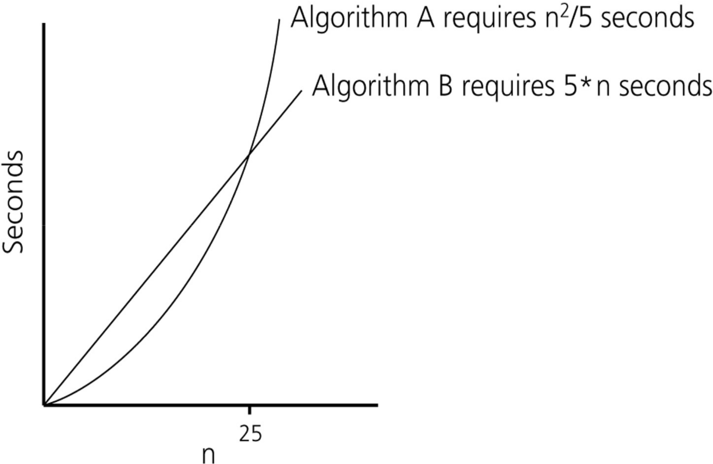
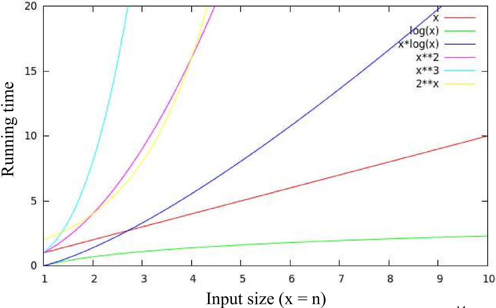
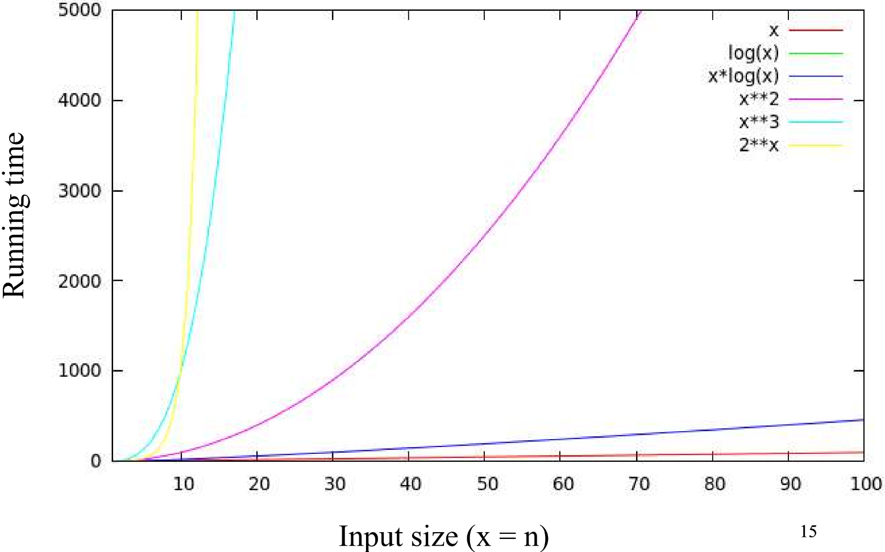
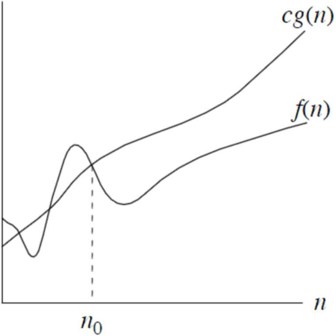

MIT License
Copyright (c) 2025 Emir Baha Yıldırım
Please see the LICENSE file for more details.

> [!NOTE]
> This is the point where the course actually starts. I will have to use LaTeX
> and graphs to actually create good and legible lecture notes, so it may or may
> not take more than the usual rate.

-------------------------------------------------------------------------------

# Algorithm Analysis

## Algorithm

- An *algorithm* is a set of definite instructions to be followed to solve a
problem.
    - There can be more than one solution (algorithm) to solve a given problem.
    - An algorithm can be implemented using different programming languages on
    different platforms.

- An algorithm must be *correct*, meaning that it should solve the problem.
    - For example, a sorting algorithm should solve the problem correctly even
    if the the input is already sorted, or it contains repeated elements. It
    should correctly output the sorted version of the input without raising
    errors.

## Algorithmic Performance

There are **2** aspects of algorithmic performance.
1. **Time:** Instructions take time.
    - How fast does the algorithm perform?
    - What affects its runtime?
2. **Space:** Data structures take space.
    - What kind of data structures can be used?
    - How does choice of data structure affect the runtime?

> [!NOTE]
> **Runtime:** the amount of time the algorithm takes to complete its execution

We will mostly focus on time. Thus learning how to estimate the time required
for an algorithm and how to reduce that time.

## Analysis of Algorithms

When we analyze algorithms, we employ mathematical techniques that analyze
algorithms independent of *specific implementations*, *computers*, or *data*.

To analyze algorithms, we first start to count the number of significant
operations in a particular solution to assess its efficiency, then, we will
express the efficiency of algorithms using growth functions.

## The Running Time of Algorithms

Each instruction (operation) in an algorithm (program) has a cost, because each
operation takes a certain time, whether it's being run on an old
[Intel 8086](https://en.wikipedia.org/wiki/Intel_8086), or a top-of-the-line
[AMD Ryzen 9950X3D](https://en.wikipedia.org/wiki/AMD_Ryzen_9950X3D). Although,
it will be vastly different lengths of time, it will grow just the same. We'll
see what I mean in a few sections.
```cpp
count = count + 1; // takes a certain amount of time on both cpus, but is constant
```
A sequence of operations:
```cpp
count = count + 1; // Cost: c1
sum = sum + count; // Cost: c2
```
Total cost of the above program would be $`c_1 + c_2`$, independent of what
$`c_1`$ or $`c_2`$ actually is.

## Runtime Analysis

Runtime analysis is the process of determining the amount of time an algorithm
takes to complete as a function of the length of the input.
```cpp
// Example: Simple If-Statement
                   // Cost    Times
if (n < 0) {       //  c1       1
    absval = -n;   //  c2       1
}
else {
    absval = n;    //  c3       1
}
```
$`c_T \le c_1 + max(c_2, c_3)`$

```cpp
// Example: Simple Loop
                      // Cost    Times
int i = 1;            //  c1       1
int sum = 0;          //  c2       1
while (i <= n) {      //  c3      n+1
    i = i + 1;        //  c4       n
    sum = sum + 1;    //  c5       n
}
```
$`c_T = c_1 + c_2 + (n+1).c_3 + n.c_4 + n.c_5`$

Thus, the time required for this algorithm is proportional to $`n`$. So, even
if the 8086 takes `10` times longer to execute each instruction than the Ryzen,
both will have their runtimes grow linearly with $`n`$.

```cpp
// Example: Nested Loop
                          // Cost    Times
int i = 1;                //  c1       1
int sum = 0;              //  c2       1
while (i <= n) {          //  c3      n+1
    int j = 1;            //  c4       n
    while (j <= n) {      //  c5    n*(n+1)
        sum = sum + i;    //  c6      n*n
        j = j + 1;        //  c7      n*n
    }
    i = i + 1;            //  c8       n
}
```
$`c_T = c_1 + c_2 + (n+1).c_3 + n.c_4 + n.(n+1).c_5 + n.n.c_6 + n.n.c_7 + n.c_8`$
$`c_T = c_1 + c_2 + (n+1).c_3 + n.c_4 + n.(n+1).c_5 + {n^2}.c_6 + {n^2}.c_7 + n.c_8`$

Thus, the time required for this algorithm is proportional to $`n^2`$.

## Example: Nested Loop

**Problem:** Given $`n`$ numbers in an array `A`, calculate the sum of all
distinct pairwise multiplications.
```cpp
// A is an array of integers of size n
double sum = 0.0;
for (int i = 0; i < n; i++) {
    for (int j = i; j < n; j++) {
        sum += A[i] * A[j];
    }
}
```
$`\sum_{i=0}^{n-1} (n - i) = n + (n-1) + (n-2) + ... + 1 = \frac{n(n+1)}{2}`$

Thus, the time required for this algorithm is proportional to $`n^2`$.

## Exercise

Which of these loops take constant time regardless of the value of $`n`$?
1) `for (i=n/10; i<n; i++) sum+=i;`
2) `for (i=0; i<n; i+=n/10) sum++;`
3) `for (i=n; i<2*n; i++) sum--;`
4) `for (i=0; i<n; i+=10) sum++;`
5) `for (i=0; i<n/10; i+=10) sum*=2;`

<details>
    <summary> Solution </summary>

Answer: **2.**

*1.* Would grow linearly with $`n`$, because $`i`$ starts at $`\frac{n}{10}`$
but grows by $`1`$ at every iteration. If $`n`$ were $`10`$ times bigger, the
algorithm would take $`10`$ times longer.

**2.** Would always take up to $`10`$ steps, because $`i`$ starts at $`0`$, but
grows by $`\frac{n}{10}`$ at every iteration, so even if $`n`$ was $`10`$ times
bigger, the algorithm would still take $`10`$ steps.

*3.* Again, would grow linearly, because $`n`$ could be $`10`$ times bigger and
$`i`$ still grows by $`1`$ at every iteration.

*4.* This option would grow linearly, too, because although we're now
incrementing $`i`$ by $`10`$ at every step, if $`n`$ was $`10`$ times bigger,
it would take us $`10`$ times more time.

*5.* Same thing as option 4.
</details>

## Algorithm Growth Rates

- We measure an algorithm's time requirement as a function of the *problem size*.
    - Problem size depends on the application. (E.g. number of elements in a
    list for a sorting algorithm, number of disks for towers of Hanoi, etc.)
- The most important thing to learn is how quickly the algorithm's time
requirement grows as a function of the problem size.
    - Algorithm `A` requires time, proportional to $`n^2`$.
    - Algorithm `B` requires time, proportional to $`n`$.
- An algorithm's proportional time requirement is known as ***growth rate***.
- We can compare the efficiency of two algorithms by comparing their growth
rates.

### Time Requirements as a Function of the Problem Size $`n`$
<a href="../slides/w03.pdf">
    
</a>

### Running Times for Small Inputs of Different Functions
<a href="../slides/w03.pdf">
    
</a>

### Running Times for Large Inputs of Different Functions
<a href="../slides/w03.pdf">
    
</a>

## Big-O Notation

The Big-O notation is a mathematical notation that describes the *limiting*
behavior of a function when the argument tends towards a particular value or
infinity. We use Big-O notation to describe the computation time
(**complexity**) of algorithms using algebraic terms. `O` stands for `order`,
as in `order of magnitude`.

### Formal Definition

$`O(g(n)) = \{f(n) \text{: there exist positive constants } c \text{ and } n_0 \text{ such that } 0 \le f(n) \le c.g(n) \text{ for all } n \ge n_0\}`$
<a href="../slides/w03.pdf">
    
</a>
$`
g(n) \text{ is an \textit{asymptotic upper bound} for } f(n).\\
\text{If } f(n) \in O(g(n)) \text{, we write } f(n) = O(g(n))
`$

