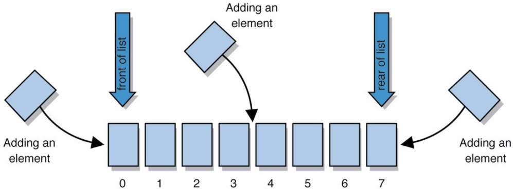
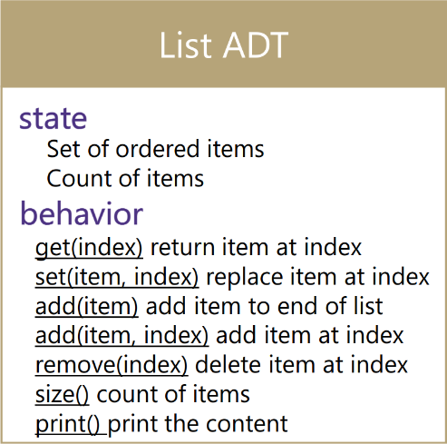
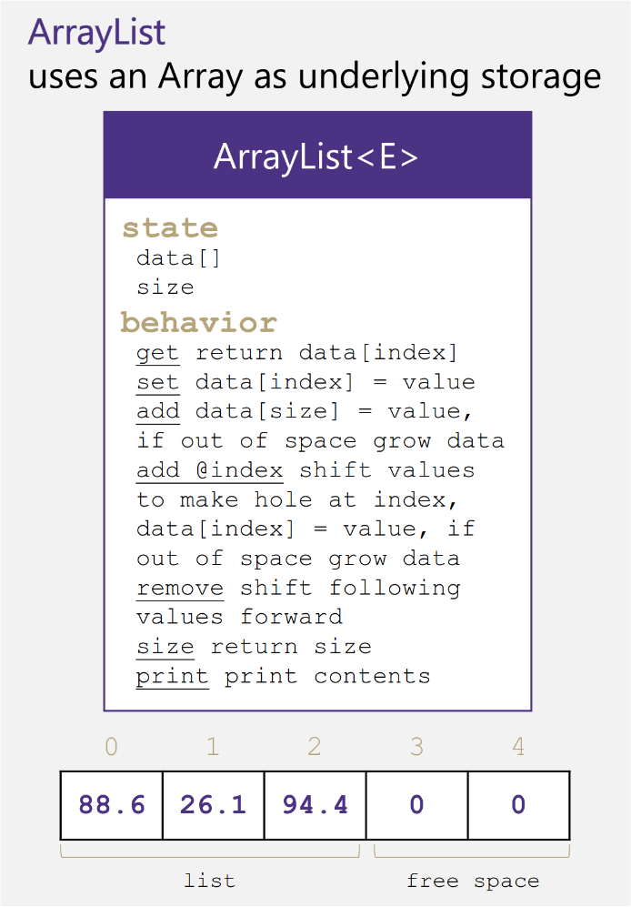
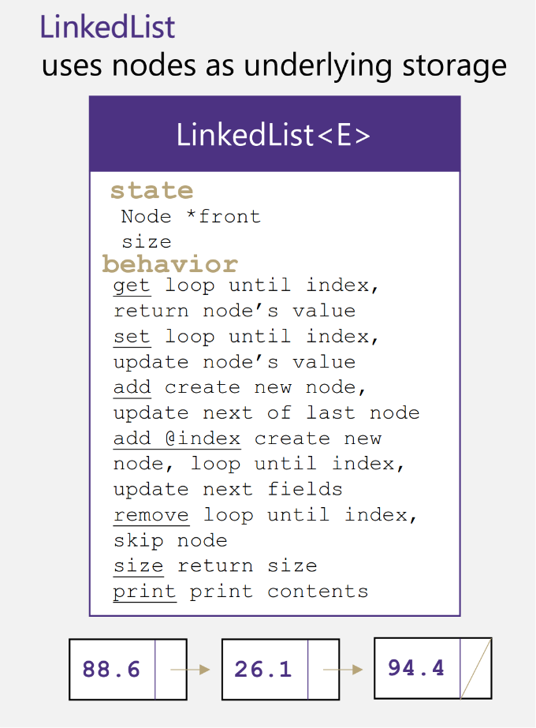
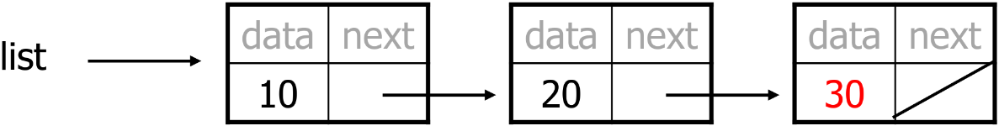
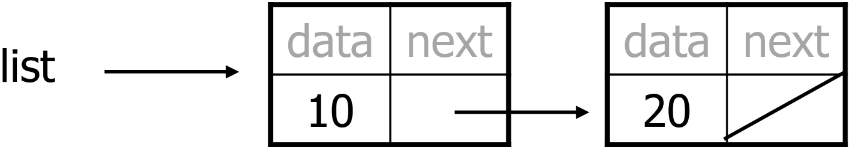
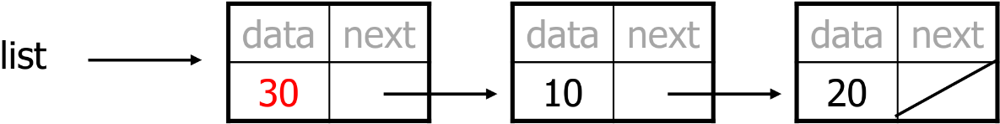
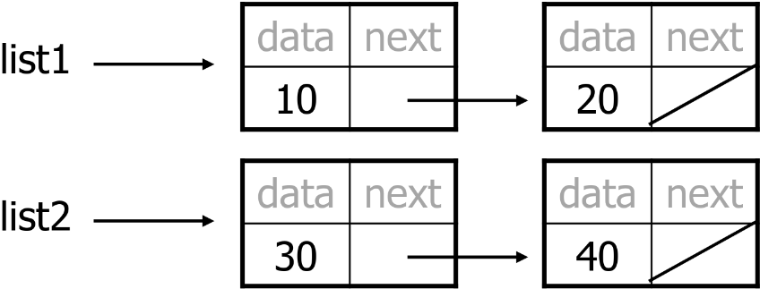
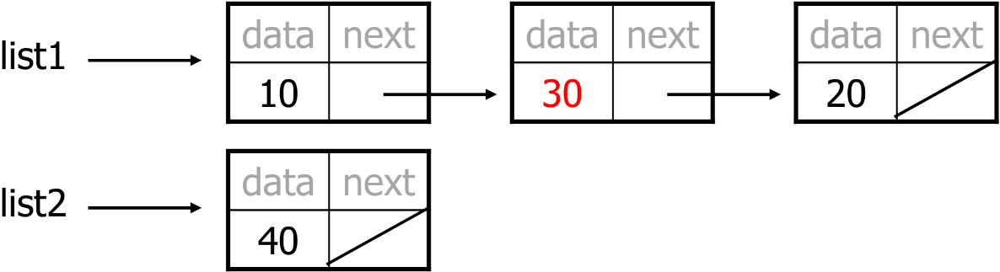
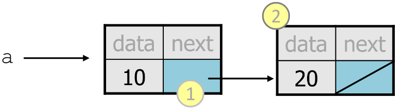

MIT License
Copyright (c) 2025 Emir Baha Yıldırım
Please see the LICENSE file for more details.

> [!NOTE]
> Now, we start working with actual data structures.

-------------------------------------------------------------------------------

# Definitions

## Data Structure

A data structure is a particular way of organizing and storing data in a
computer so that it can be accessed and modified efficiently. Different data
structures are suited to different kinds of applications, and some are highly
specialized to specific tasks. Common data structures include arrays, linked
lists, stacks, queues, trees, hash tables, and graphs.

## Abstract Data Type (ADT)

An abstract data type (ADT) is a mathematical model for a certain class of data
structures that have similar behavior. It is a specification of:
- **The Data:** The collection of data elements.
- **The Operations:** The set of functions that can be performed on that data
(e.g., `insert`, `remove`, `search`).

- **The Core of the Concept:**
    > **An ADT defines *what* a collectionof data does, not *how* it does it.**
    - It is an **interface** that specifies behavior without revealing the
    underlying implementation details.
    - **Example:** A **List** is an **ADT**. You know you can add or remove
    elements.
    - **Constrast:** A **Linked List** or an **Array** are the concrete **Data
    Structures** used to *implement* the List ADT.

So, even if we don't know exactly how an ADT is implemented, we just need to
understand the idea of the collection and what operations it can perform. We
use data structures to provide a concrete, physical implementation of an ADT.

-------------------------------------------------------------------------------

# List ADT

<a href="../slides/w04.pdf">
    
</a>

- A **List** is a collection storing an ordered sequence of elements.
    - Each element is accessible by a 0-based index.
    - A list has a size, number of elements that have been added.
    - Elements can be added to the front, back, or to a specific index.


<a href="../slides/w04.pdf">
    
</a>

- *Supported Operations:*
    - `get(index)`: returns the item at the given index
    - `set(value, index)`: sets the item at the given index to the given value
    - `add(value)`: adds the given item to the end of the list
    - `add(value, index)`: insert the given item at the given index maintaining
    order
    - `remove(index)`: removes the item at the given index maintaining order
    - `size()`: returns the number of elements in the list
    - `print()`: prints the contents of the list

## List Implementations

<a href="../slides/w04.pdf">
    
</a>

- **Array List:**
    - Uses a dynamic array to store elements.
    - Provides fast access to elements via indexing.
    - Insertion and deletion can be slow due to shifting elements.
    - Resizing the array may be necessary when it reaches capacity.

<a href="../slides/w04.pdf">
    
</a>

- **Linked List:**
    - Consists of nodes where each node contains data and a pointer/reference
    to the next node.
    - We only know the address of the first node in a singly linked list
    without a dummy node.
    - Other nodes are reached by following the `next` pointers, which the last
    node's `next` is `nullptr`.
    - Allows for efficient insertions and deletions.
    - Accessing elements requires traversal from the head node.
    - Uses more memory due to storing pointers/references, but avoids resizing.

### `LinkedList` vs. `ArrayList`

In a linked list, nodes are not necessarily contigous in memory, while in an
array list all elements are stored in contiguous memory locations. By contigous
we mean that the elements are stored one after another without any gaps. In a
linked list, each node is allocated with a separate `new` call.

- **Advantages of Arrays**
    - Can directly select any element.
    - No memory wasted for storing pointers.
- **Disadvantages of Arrays**
    - Fixed size (cannot grow or shrink dynamically).
    - Need to shift elements to insert an element to the middle.
    - Memory wasted due to unused elements.
- **Advantages of Linked Lists**
    - Dynamic size (can grow and shrink as needed)
    - No need to shift elements to insert into the middle
    - Size can exactly match the number of elements (no wasted memory)
- **Disadvantages of Linked Lists**
    - Cannot directly select any element (need to follow pointers)
    - Extra memory usage for storing pointers

### Design Decisions

- For every ADT there are lots of different ways to implement them.
- Based on the situation, you should consider:
    - Memory vs. Speed
    - Generic/Reusability vs Specific/Specialized
    - Robustness vs Performance

This course is all about implementing ADTs based on making right design
tradeoffs.

### Implementing `ArrayList`

<!-- I'll explain every method in it's respective block. -->

<details>
    <summary> Class ArrayList with Error Handling and Explanations of Each Method in the Class </summary>

```cpp
// ArrayList.h
#include <stdexcept>
#include <iostream>

// ArrayList class implementing the List ADT using a dynamic array
class ArrayList {
private:
    int* arr;        // Pointer to the dynamic array
    int length;      // Current number of elements in the list
public:
    ArrayList() : length(0) { // Constructor
        arr = new int[0]; // Initialize an empty dynamic array
    }
    ~ArrayList() { // Destructor
        delete[] arr; // Clean up the dynamic array
    }
    // Don't forget, we're not keeping track of a capacity, this is dynamic.
    void add(int value) { // Add an element to the end of the list
        int newLength = length + 1; // New length after adding an element
        int* newArr = new int[newLength]; // Create a new array with increased size
        for (int i = 0; i < length; i++) { // Copy existing elements to the new array
            newArr[i] = arr[i];
        }
        newArr[length] = value; // Add the new element at the end
        delete[] arr; // Delete the old array
        arr = newArr; // Point to the new array
        length++; // Increase the size
    }
    // Overload the add method to insert at a specific index
    void add(int value, int index) { // Add an element at a specific index
        if (index < 0 || index > length) { // Check for valid index
            throw std::out_of_range("Index out of bounds"); // Error handling
        }
        int newLength = length + 1; // New length after adding an element
        int* newArr = new int[newLength]; // Create a new array with increased size
        for (int i = 0; i < index; i++) { // Copy elements before the index
            newArr[i] = arr[i];
        }
        newArr[index] = value; // Insert the new element at the specified index
        for (int i = index; i < length; i++) { // Copy remaining elements
            newArr[i + 1] = arr[i];
        }
        delete[] arr; // Delete the old array
        arr = newArr; // Point to the new array
        length++; // Increase the size
    }
    int get(int index) { // Get the element at a specific index
        if (index < 0 || index >= length) { // Check for valid index
            throw std::out_of_range("Index out of bounds"); // Error handling
        }
        return arr[index]; // Return the element at the given index
    }
    void set(int value, int index) { // Set the element at a specific index
        if (index < 0 || index >= length) { // Check for valid index
            throw std::out_of_range("Index out of bounds"); // Error handling
        }
        arr[index] = value; // Set the element at the given index
    }
    void remove(int index) { // Remove the element at a specific index
        if (index < 0 || index >= length) { // Check for valid index
            throw std::out_of_range("Index out of bounds"); // Error handling
        }
        for (int i = index; i < length - 1; i++) { // Shift elements to the left
            arr[i] = arr[i + 1];
        }
        length--; // Decrease the size
    }
    int size() { // Get the current size of the list
        return length; // Return the number of elements
    }
    void print() { // Print the contents of the list
        for (int i = 0; i < length; i++) { // Iterate through the elements
            std::cout << arr[i] << " "; // Print each element
        }
        std::cout << std::endl; // New line after printing all elements
    }
};
```

We can test our class with the following `main`.

```cpp
// test-ArrayList.cpp
int main()
{
    // Test the ArrayList class
    ArrayList arrayList;
    arrayList.add(10);
    arrayList.add(20);
    arrayList.add(30, 1); // Insert 30 at index 1 - should be [10, 30, 20]
    arrayList.print(); // Expected output: 10 30 20
    arrayList.set(25, 2); // Set index 2 to 25 - should be [10, 30, 25]
    arrayList.print(); // Expected output: 10 30 25
    arrayList.remove(1); // Remove index 1 - should be [10, 25
    arrayList.print(); // Expected output: 10 25
    std::cout << "Element at index 0: " << arrayList.get(0) << std::endl; // Expected output: 10
    std::cout << "Size of list: " << arrayList.size() << std::endl; // Expected output: 2
}
```

Output should be the following:
```
10 30 20
10 30 25
10 25
Element at index 0: 10
Size of list: 2
```
</details>

### Implementing `LinkedList`

- Each list node stores;
    - one piece of integer data, and
    - a reference to another list node.
- `ListNode`s can be *linked* into chains to store a list of values:

<details>
    <summary>Class LinkedList with Error Handling and Explanations of Each Method in the Class </summary>

```cpp
// LinkedList.h
#include <iostream>
#include <stdexcept>

class ListNode {
public:
    int data; // Data part of the node
    ListNode* next; // Pointer to the next node
    ListNode(int value) : data(value), next(nullptr) {} // Constructor for nodes
    ListNode(int value, ListNode* ptr) : data(value), next(ptr) {} // Constructor with next pointer
};

class LinkedList {
private:
    ListNode* head; // Pointer to the first node in the list
    int length; // Current number of elements in the list
public:
    LinkedList() : head(nullptr), length(0) {} // Constructor
    ~LinkedList() { // Destructor
        ListNode* current = head;
        while (current != nullptr) { // Traverse the list and delete nodes
            ListNode* nextNode = current->next;
            delete current;
            current = nextNode;
        }
    }
    void add(int value) { // Add an element to the end of the list
        // We will use the second constructor
        ListNode* newNode = new ListNode(value); // Create a new node
        if (head == nullptr) { // If the list is empty
            head = newNode; // New node becomes the head
        }
        else {
            ListNode* current = head;
            while (current->next != nullptr) { // Traverse to the end of the list
                current = current->next;
            }
            current->next = newNode; // Link the new node at the end
        }
        length++; // Increase the size
    }
    void add(int value, int index) { // Add an element at a specific index, we'll use the second constructor
        if (index < 0 || index > length) { // Check for valid index
            throw std::out_of_range("Index out of bounds"); // Error handling
        }
        if (index == 0) { // Insert at the head
            ListNode* newNode = new ListNode(value, head); // Create a new node pointing to current head
            head = newNode; // Update head to the new node
        }
        else {
            ListNode* current = head;
            for (int i = 0; i < index - 1; i++) { // Traverse to the node before the index
                current = current->next;
            }
            ListNode* newNode = new ListNode(value, current->next); // Create a new node pointing to the next node
            current->next = newNode; // Link the new node in the list
        }
        length++; // Increase the size
    }
    int get(int index) { // Get the element at a specific index
        if (index < 0 || index >= length) { // Check for valid index
            throw std::out_of_range("Index out of bounds"); // Error handling
        }
        ListNode* current = head;
        for (int i = 0; i < index; i++) { // Traverse to
            current = current->next;
        }
        return current->data; // Return the data at the given index
    }
    void set(int value, int index) { // Set the element at a specific index
        if (index < 0 || index >= length) { // Check for valid index
            throw std::out_of_range("Index out of bounds"); // Error handling
        }
        ListNode* current = head;
        for (int i = 0; i < index; i++) { // Traverse to
            current = current->next;
        }
        current->data = value; // Set the data at the given index
    }
    void remove(int index) { // Remove the element at a specific index
        if (index < 0 || index >= length) { // Check for valid index
            throw std::out_of_range("Index out of bounds"); // Error handling
        }
        if (index == 0) { // Remove the head
            ListNode* temp = head;
            head = head->next;
            delete temp;
        }
        else {
            ListNode* current = head;
            for (int i = 0; i < index - 1; i++) {
                current = current->next;
            }
            ListNode* temp = current->next;
            current->next = temp->next; // Bypass the node to be removed
            delete temp;
        }
        length--; // Decrease the size
    }
    int size() { // Get the current size of the list
        return length; // Return the number of elements
    }
    void print() { // Print the contents of the list
        ListNode* current = head;
        while (current != nullptr) { // Traverse through the list
            std::cout << current->data << " "; // Print each element
            current = current->next;
        }
        std::cout << std::endl; // New line after printing all elements
    }
};
```

We can test our class with the following `main`.

```cpp
// test-LinkedList.cpp
int main()
{
    // test the LinkedList class
    LinkedList linkedList;
    linkedList.add(10);
    linkedList.add(20);
    linkedList.add(30);
    linkedList.print(); // Expected output: 10 20 30
    linkedList.add(15, 1);
    linkedList.print(); // Expected output: 10 15 20 30
    std::cout << "Element at index 2: " << linkedList.get(2) << std::endl; // Expected output: 20
    linkedList.set(25, 2);
    linkedList.print(); // Expected output: 10 15 25 30
    linkedList.remove(1);
    linkedList.print(); // Expected output: 10 25 30
    std::cout << "Size of the list: " << linkedList.size() << std::endl; // Expected output: 3
}
```

Output of the `main` function should be the following:
```
10 20 30
10 15 20 30
Element at index 2: 20
10 15 25 30
10 25 30
Size of the list: 3
```
</details>

-------------------------------------------------------------------------------

# Practice Problems

## Linked Node Problem 1

What set of statements turns this picture:

<a href="../slides/w04.pdf">
    
</a>

Into this:

<a href="../slides/w04.pdf">
    
</a>

<details>
    <summary> Solution </summary>

Use the `add(value)` method to add a new node with value `30` at the end of
the list.
```cpp
linkedList.add(30);
```
</details>

## Linked Node Problem 2

What set of statements turns this picture:

<a href="../slides/w04.pdf">
    
</a>

Into this:

<a href="../slides/w04.pdf">
    
</a>

<details>
    <summary> Solution </summary>

Use the `add(value, index)` method to add a new node with value `30` at index
`0`.
```cpp
linkedList.add(30, 0);
```
</details>

## Linked Node Problem 3

What set of statements turns this picture:

<a href="../slides/w04.pdf">
    
</a>

Into this:

<a href="../slides/w04.pdf">
    
</a>

<details>
    <summary> Solution </summary>

In this case, we have 2 lists, one starting with a node with data `10` pointing
to a node with data `20`, and another list starting with a node with data `30`
pointing to a node with data `40`. We want to move node with data `30` to be
after node with data `10`, and node with data `30` only. Meaning that the
second list will be left with a single node with data `40`.
```cpp
list1.add(30, 1); // add a node with data 30 to index 1 of list1
list2.remove(0); // remove the node with data 30 from list2
```
</details>

-------------------------------------------------------------------------------

## Pointers vs. Objects

`variable = value;`

- A *variable* (left side of =) is an arrow (the base of an arrow).
- A *value*   (right side of =) is an object (a box: what an arrow points at).

<a href="../slides/w04.pdf">
    
</a>

- For the list above:
    - `a->next = value;` means to adjust where `1` points
    - `variable = a->next;` means to make `variable` point at `2`
