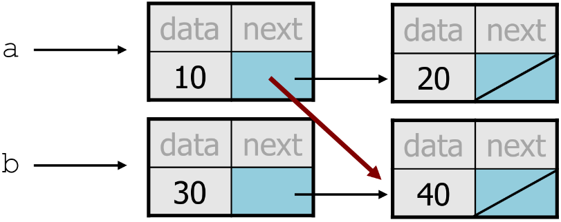
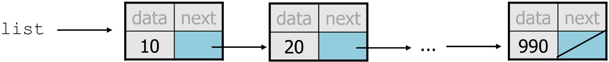
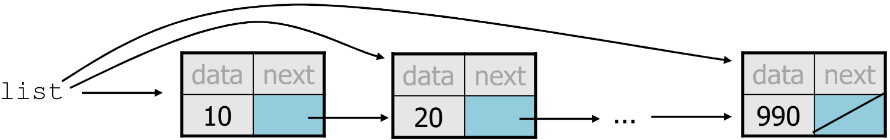
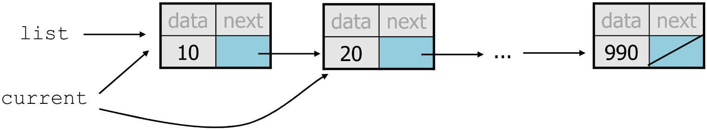

MIT License
Copyright (c) 2025 Emir Baha Yıldırım
Please see the LICENSE file for more details.

> [!NOTE]
> Now, we start working with actual data structures.

-------------------------------------------------------------------------------

# Definitions

## Data Structure

A data structure is a particular way of organizing and storing data in a
computer so that it can be accessed and modified efficiently. Different data
structures are suited to different kinds of applications, and some are highly
specialized to specific tasks. Common data structures include arrays, linked
lists, stacks, queues, trees, hash tables, and graphs.

## Abstract Data Type (ADT)

An abstract data type (ADT) is a mathematical model for a certain class of data
structures that have similar behavior. It is a specification of:
- **The Data:** The collection of data elements.
- **The Operations:** The set of functions that can be performed on that data
(e.g., `insert`, `remove`, `search`).

- **The Core of the Concept:**
    > **An ADT defines *what* a collection of data does, not *how* it does it.**
    - It is an **interface** that specifies behavior without revealing the
    underlying implementation details.
    - **Example:** A **List** is an **ADT**. You know you can add or remove
    elements.
    - **Contrast:** A **Linked List** or an **Array** are the concrete **Data
    Structures** used to *implement* the List ADT.

So, even if we don't know exactly how an ADT is implemented, we just need to
understand the idea of the collection and what operations it can perform. We
use data structures to provide a concrete, physical implementation of an ADT.

-------------------------------------------------------------------------------

# List ADT

<a href="../slides/w04.pdf">
    
</a>

- A **List** is a collection storing an ordered sequence of elements.
    - Each element is accessible by a 0-based index.
    - A list has a size, number of elements that have been added.
    - Elements can be added to the front, back, or to a specific index.


<a href="../slides/w04.pdf">
    
</a>

- *Supported Operations:*
    - `get(index)`: returns the item at the given index
    - `set(value, index)`: sets the item at the given index to the given value
    - `add(value)`: adds the given item to the end of the list
    - `add(value, index)`: insert the given item at the given index maintaining
    order
    - `remove(index)`: removes the item at the given index maintaining order
    - `size()`: returns the number of elements in the list
    - `print()`: prints the contents of the list

## List Implementations

<a href="../slides/w04.pdf">
    
</a>

- **Array List:**
    - Uses a dynamic array to store elements.
    - Provides fast access to elements via indexing.
    - Insertion and deletion can be slow due to shifting elements.
    - Resizing the array may be necessary when it reaches capacity.

<a href="../slides/w04.pdf">
    
</a>

- **Linked List:**
    - Consists of nodes where each node contains data and a pointer/reference
    to the next node.
    - We only know the address of the first node in a singly linked list
    without a dummy node.
    - Other nodes are reached by following the `next` pointers, which the last
    node's `next` is `nullptr`.
    - Allows for efficient insertions and deletions.
    - Accessing elements requires traversal from the head node.
    - Uses more memory due to storing pointers/references, but avoids resizing.

### `Linked List` vs. `Array List`

In a linked list, nodes are not necessarily contiguous in memory, while in an
array list all elements are stored in contiguous memory locations. By
contiguous we mean that the elements are stored one after another without any
gaps. In a linked list, each node is allocated with a separate `new` call.

- **Advantages of Arrays**
    - Can directly select any element.
    - No memory wasted for storing pointers.
- **Disadvantages of Arrays**
    - Fixed size (cannot grow or shrink dynamically).
    - Need to shift elements to insert an element to the middle.
    - Memory wasted due to unused elements.
- **Advantages of Linked Lists**
    - Dynamic size (can grow and shrink as needed)
    - No need to shift elements to insert into the middle
    - Size can exactly match the number of elements (no wasted memory)
- **Disadvantages of Linked Lists**
    - Cannot directly select any element (need to follow pointers)
    - Extra memory usage for storing pointers

### Design Decisions

- For every ADT there are lots of different ways to implement them.
- Based on the situation, you should consider:
    - Memory vs. Speed
    - Generic/Reusability vs Specific/Specialized
    - Robustness vs Performance

This course is all about implementing ADT's based on making right design
tradeoffs.

> [!NOTE]
> Technically, you should only have the definitions of the methods in the
> header file, and then you should have a different implementation file with
> the same name but ending with `.cpp`. I implemented the entire class in the
> header for the sake of saving space in this markdown.

### Implementing `ArrayList`

<!-- I'll explain every method in it's respective block. -->

<details>
    <summary> Class ArrayList with Error Handling and Explanations of Each Method in the Class </summary>

```cpp
// ArrayList.h
#include <stdexcept>
#include <iostream>

// ArrayList class implementing the List ADT using a dynamic array
class ArrayList {
private:
    int* arr;        // Pointer to the dynamic array
    int length;      // Current number of elements in the list
public:
    ArrayList() : length(0) { // Constructor
        arr = new int[0]; // Initialize an empty dynamic array
    }
    ~ArrayList() { // Destructor
        delete[] arr; // Clean up the dynamic array
    }
    // Don't forget, we're not keeping track of a capacity, this is dynamic.
    void add(int value) { // Add an element to the end of the list
        int newLength = length + 1; // New length after adding an element
        int* newArr = new int[newLength]; // Create a new array with increased size
        for (int i = 0; i < length; i++) { // Copy existing elements to the new array
            newArr[i] = arr[i];
        }
        newArr[length] = value; // Add the new element at the end
        delete[] arr; // Delete the old array
        arr = newArr; // Point to the new array
        length++; // Increase the size
    }
    // Overload the add method to insert at a specific index
    void add(int value, int index) { // Add an element at a specific index
        if (index < 0 || index > length) { // Check for valid index
            throw std::out_of_range("Index out of bounds"); // Error handling
        }
        int newLength = length + 1; // New length after adding an element
        int* newArr = new int[newLength]; // Create a new array with increased size
        for (int i = 0; i < index; i++) { // Copy elements before the index
            newArr[i] = arr[i];
        }
        newArr[index] = value; // Insert the new element at the specified index
        for (int i = index; i < length; i++) { // Copy remaining elements
            newArr[i + 1] = arr[i];
        }
        delete[] arr; // Delete the old array
        arr = newArr; // Point to the new array
        length++; // Increase the size
    }
    int get(int index) { // Get the element at a specific index
        if (index < 0 || index >= length) { // Check for valid index
            throw std::out_of_range("Index out of bounds"); // Error handling
        }
        return arr[index]; // Return the element at the given index
    }
    void set(int value, int index) { // Set the element at a specific index
        if (index < 0 || index >= length) { // Check for valid index
            throw std::out_of_range("Index out of bounds"); // Error handling
        }
        arr[index] = value; // Set the element at the given index
    }
    void remove(int index) { // Remove the element at a specific index
        if (index < 0 || index >= length) { // Check for valid index
            throw std::out_of_range("Index out of bounds"); // Error handling
        }
        for (int i = index; i < length - 1; i++) { // Shift elements to the left
            arr[i] = arr[i + 1];
        }
        length--; // Decrease the size
    }
    int size() { // Get the current size of the list
        return length; // Return the number of elements
    }
    void print() { // Print the contents of the list
        for (int i = 0; i < length; i++) { // Iterate through the elements
            std::cout << arr[i] << " "; // Print each element
        }
        std::cout << std::endl; // New line after printing all elements
    }
};
```

We can test our class with the following `main`.

```cpp
// test-ArrayList.cpp
int main()
{
    // Test the ArrayList class
    ArrayList arrayList;
    arrayList.add(10);
    arrayList.add(20);
    arrayList.add(30, 1); // Insert 30 at index 1 - should be [10, 30, 20]
    arrayList.print(); // Expected output: 10 30 20
    arrayList.set(25, 2); // Set index 2 to 25 - should be [10, 30, 25]
    arrayList.print(); // Expected output: 10 30 25
    arrayList.remove(1); // Remove index 1 - should be [10, 25
    arrayList.print(); // Expected output: 10 25
    std::cout << "Element at index 0: " << arrayList.get(0) << std::endl; // Expected output: 10
    std::cout << "Size of list: " << arrayList.size() << std::endl; // Expected output: 2
}
```

Output should be the following:
```
10 30 20
10 30 25
10 25
Element at index 0: 10
Size of list: 2
```
</details>

### Implementing `LinkedIntList`

- Each list node stores;
    - one piece of integer data, and
    - a reference to another list node.
- `ListNode`s can be *linked* into chains to store a list of values:

<details>
    <summary>Class LinkedIntList with Error Handling and Explanations of Each Method in the Class </summary>

<!-- TODO: CHECK THIS HEADER FILE, PROBABLY NEEDS SOME CHANGES -->
```cpp
// LinkedIntList.h
#include <iostream>
#include <stdexcept>

class ListNode {
public:
    int data; // Data part of the node
    ListNode* next; // Pointer to the next node
    ListNode(int value) : data(value), next(nullptr) {} // Constructor for nodes
    ListNode(int value, ListNode* ptr) : data(value), next(ptr) {} // Constructor with next pointer
};

class LinkedIntList {
private:
    ListNode* head; // Pointer to the first node in the list
    int length; // Current number of elements in the list
public:
    LinkedIntList() : head(nullptr), length(0) {} // Constructor
    ~LinkedIntList() { // Destructor
        ListNode* current = head;
        while (current != nullptr) { // Traverse the list and delete nodes
            ListNode* nextNode = current->next;
            delete current;
            current = nextNode;
        }
    }
    LinkedIntList(const LinkedIntList& rhs) { // Copy constructor
        head = nullptr;
        length = 0;
        ListNode* current = rhs.head;
        while (current != nullptr) { // Traverse the rhs list
            add(current->data); // Add each element to the new list
            current = current->next;
        }
    }
    void add(int value, int index) : index(this->length) { // Add an element at a specific index, we'll use the second constructor
        if (index < 0 || index > this->length) { // Check for valid index
            throw std::out_of_range("Index out of bounds"); // Error handling
        }
        if (index == 0) { // Insert at the head
            ListNode* newNode = new ListNode(value, this->head); // Create a new node pointing to current head
            this->head = newNode; // Update head to the new node
        }
        else {
            ListNode* current = this->head;
            for (int i = 0; i < index - 1; i++) { // Traverse to the node before the index
                current = current->next;
            }
            ListNode* newNode = new ListNode(value, current->next); // Create a new node pointing to the next node
            current->next = newNode; // Link the new node in the list
        }
        length++; // Increase the size
    }
    int get(int index) { // Get the element at a specific index
        if (index < 0 || index >= this->length) { // Check for valid index
            throw std::out_of_range("Index out of bounds"); // Error handling
        }
        ListNode* current = this->head;
        for (int i = 0; i < index; i++) { // Traverse to
            current = current->next;
        }
        return current->data; // Return the data at the given index
    }
    void set(int value, int index) { // Set the element at a specific index
        if (index < 0 || index >= this->length) { // Check for valid index
            throw std::out_of_range("Index out of bounds"); // Error handling
        }
        ListNode* current = head;
        for (int i = 0; i < index; i++) { // Traverse to
            current = current->next;
        }
        current->data = value; // Set the data at the given index
    }
    void remove(int index) { // Remove the element at a specific index
        if (index < 0 || index >= this->length) { // Check for valid index
            throw std::out_of_range("Index out of bounds"); // Error handling
        }
        if (index == 0) { // Remove the head
            ListNode* temp = this->head;
            head = head->next;
            delete temp;
        }
        else {
            ListNode* current = head;
            for (int i = 0; i < index - 1; i++) {
                current = current->next;
            }
            ListNode* temp = current->next;
            current->next = temp->next; // Bypass the node to be removed
            delete temp;
        }
        length--; // Decrease the size
    }
    int size() { // Get the current size of the list
        return length; // Return the number of elements
    }
    void print() { // Print the contents of the list
        ListNode* current = head;
        while (current != nullptr) { // Traverse through the list
            std::cout << current->data << " "; // Print each element
            current = current->next;
        }
        std::cout << std::endl; // New line after printing all elements
    }
    void indexOf(int value) { // Find the index of a specific value
        ListNode* current = head; // Start from the head
        int i = 0; // Initialize index counter
        while (current != nullptr) { // Traverse through the list
            if (value == current->data) { // Check if the current node's data matches the value
                std::cout << "Index of " << value << ": " << i << std::endl;
                break; // Found the index, break out of the loop.
            }
            else if (current->next == nullptr) { // If we reached the end of the list
                std::cout << value << " is not in the list." << std::endl;
                break; // Item not in list, break out of the loop.
            }
            else { // Move to the next node and increment index
                current = current->next; // Move to the next node
                i++; // Increment index counter
            }
        }
    }
};
// I'm pretty happy with how this one turned out lol.
```

We can test our class with the following `main`.

```cpp
// test-LinkedIntList.cpp
int main()
{
    // test the LinkedIntList class
    LinkedIntList linkedList;
    linkedList.add(10); // add value at the end of the list
    linkedList.add(20); // add value at the end of the list
    linkedList.add(30); // add value at the end of the list
    linkedList.print(); // Expected output: 10 20 30
    linkedList.add(15, 1); // add value at the given index
    linkedList.print(); // Expected output: 10 15 20 30
    std::cout << "Element at index 2: " << linkedList.get(2) << std::endl; // Expected output: 20
    linkedList.set(25, 2); // change the value at the given index
    linkedList.print(); // Expected output: 10 15 25 30
    linkedList.indexOf(15); // Expected output: Index of 15: 1
    linkedList.remove(1); // remove the node at the given index
    linkedList.print(); // Expected output: 10 25 30
    std::cout << "Size of the list: " << linkedList.size() << std::endl; // Expected output: 3
}
```

Output of the `main` function should be the following:
```
10 20 30
10 15 20 30
Element at index 2: 20
10 15 25 30
10 25 30
Size of the list: 3
```
</details>

<details>
    <summary> What if we need to store floats, or doubles? </summary>

That's where `class templates` come into play. I will leave the implementation
of that template to you at the end of this markdown as an assignment.
</details>

-------------------------------------------------------------------------------

# Practice Problems

## Linked Node Problem 1

What set of statements turns this picture:

<a href="../slides/w04.pdf">
    
</a>

Into this:

<a href="../slides/w04.pdf">
    
</a>

<details>
    <summary> Solution </summary>

Use the `add(value)` method to add a new node with value `30` at the end of
the list.
```cpp
list.add(30);
```
</details>

## Linked Node Problem 2

What set of statements turns this picture:

<a href="../slides/w04.pdf">
    
</a>

Into this:

<a href="../slides/w04.pdf">
    
</a>

<details>
    <summary> Solution </summary>

Use the `add(value, index)` method to add a new node with value `30` at index
`0`.
```cpp
list.add(30, 0);
```
</details>

## Linked Node Problem 3

What set of statements turns this picture:

<a href="../slides/w04.pdf">
    
</a>

Into this:

<a href="../slides/w04.pdf">
    
</a>

<details>
    <summary> Solution </summary>

In this case, we have 2 lists, one starting with a node with data `10` pointing
to a node with data `20`, and another list starting with a node with data `30`
pointing to a node with data `40`. We want to move node with data `30` to be
after node with data `10`, and node with data `30` only. Meaning that the
second list will be left with a single node with data `40`.
```cpp
list1.add(30, 1); // add a node with data 30 to index 1 of list1
list2.remove(0); // remove the node with data 30 from list2
```
</details>

-------------------------------------------------------------------------------

# Pointers vs. Objects

`variable = value;`

- A *variable* (left side of =) is an arrow (the base of an arrow).
- A *value* (right side of =) is an object (a box: what an arrow points at).

<a href="../slides/w04.pdf">
    
</a>

- For the list above:
    - `a->next = value;` means to adjust where `1` points.
    - `variable = a->next;` means to make `variable` point at `2`.

## Reassigning Pointers

- When we say:
    - `a->next = b->next;`
- We mean:
    - "Make the *variable* `a->next` refer to the same *value* as `b->next`."
    or,
    - "Make `a->next` point to the same place that `b->next` points."

<a href="../slides/w04.pdf">
    
</a>

-------------------------------------------------------------------------------

# Printing a Linked List

Suppose we have a long chain of list nodes. We don't know exactly how long the
chain is. Let's print the data values in all the nodes.

<a href="../slides/w04.pdf">
    
</a>

One bad way to print every value in the list is the following:

```cpp
while (list != NULL) {
    std::cout << list->data << std::endl;
    list = list->next; // move to the next node
}
```

The reason this approach is bad is that we are actively losing the linked list
as it prints it.

<a href="../slides/w04.pdf">
    
</a>

## Solution

We don't change `list`. We make another variable, and change that.
```cpp
ListNode* current = list;
```

<a href="../slides/w04.pdf">
    
</a>

And we write:
```cpp
current = current->next;
```

So, the correct way to print every value in the list would be like this:
```cpp
ListNode* current = list;
while (current != NULL) {
    std::cout << current;
    current = current->next; // move to the next node
}
```
Changing `current` doesn't damage the list.

-------------------------------------------------------------------------------

# Constructing a Long List

```cpp
int main()
{
    ListNode* list = new ListNode(1);
    ListNode* p = list;

    for (int i = 2; i <= 100; i++) {
        p-> next = new ListNode(i);
        p = p->next;
    }

    p = list;
    while (p != NULL) {
        std::cout << p->data << ' ';
        p = p->next;
    }
    std::cout << std::endl;
}
```

-------------------------------------------------------------------------------

> [!NOTE]
> After this point the slides implement the `LinkedIntList` class, which we've
> already done. The only difference is that, they divide the definitions and
> implementations into 2 separate files, which you should do, but I didn't do
> it, because it fits better into a markdown. The only difference between the
> two is the syntax of the member functions' definitions.

## Example

```cpp
// LinkedIntList.h
class LinkedIntList {
private:
    ListNode* front;
    int size;
public:
    LinkedIntList() { // default constructor
        front = nullptr;
        size = 0;
    }
    ~LinkedIntList(); // destructor
    LinkedIntList(const LinkedIntList& rhs); // copy constructor
    LinkedIntList& operator=(const LinkedIntList rhs); // copy assignment op.
    void add(int value);
    void add(int value, int index);
    int get(int index);
    void set(int value, int index);
    int remove(); // throws NoSuchElementException
    void remove(int index);
    void print();
    int size();
}

// LinkedIntList.cpp

...

int LinkedIntList::remove() {
    ... // implementation
}

...
```

-------------------------------------------------------------------------------

# Using `LinkedIntList` Class

```cpp
int main()
{
    LinkedIntList list; // constructed via default constructor

    list.add(5);
    list.add(10);
    list.add(15);
    list.print(); // Output: 5 10 15
    std::cout << "Second element is " << list.get(1) << std::endl;
    try {
        list.remove(2);
        list.remove(); // removes last element
        list.remove();
        list.remove();
        list.print();
    }
    catch (NoSuchElementException e) {
        std::cout << "List is empty!" << std::endl;
    }
}
```

-------------------------------------------------------------------------------

# Exercise

Write a method `addSorted()` that accepts an integer value as a parameter and
adds that value to list in sorted order.

For example, consider this list:
```cpp
LinkedIntList list;
list.add(-4);
list.add(8);
list.add(22);

// when you use the addSorted() method, and add 17 like this
list.addSorted(17);
// and print the function
list.print();
```
The output should be:
```
-4 8 17 22
```
Realize that the value 17 is not added to the end of the list. Instead, it was
added to its correct, sorted index. You can assume that the list is already
sorted.

<details>
    <summary> Solution </summary>

```cpp
void LinkedIntList::addSorted(int value) { // adds given value to list, sorted
    // insert at the front of the list
    if (this->front == nullptr || value <= this->front->data) {
        front = new ListNode(value, front);
    }
    else {
        // insert in a middle index of the list
        ListNode* current = this->front;
        while (current->next != nullptr && current->next->data < value) {
            current = current->next;
        }
        current->next = new ListNode(value, current->next);
    }
    this->size++;
}
```
</details>

-------------------------------------------------------------------------------

# Template Classes for `Node` and `LinkedList`

## Template Class for `Node`

```cpp
#ifndef _Node
#define _Node

template<class T>
class Node {
public:
    Node(const T& e = T(), Node* n = nullptr) :
        data(e), next(n) {}
    T data;
    Node* next;
};

#endif // _Node
```

## Template Class for `LinkedList`

```cpp
#template <class T>
class LinkedList {
private:
    Node<T>* front;
    int size;
public:
    LinkedList() { // default constructor
        front = nullptr;
        size = 0;
    }
    ~LinkedList(); // destructor
    LinkedList(const LinkedList& rhs); // copy constructor
    LinkedList& operator=(const LinkedList& rhs);
    void add(T value);
    void add(int index, T value);
    T get(int index);
    void set(int index, T value);
    T remove(); // throws NoSuchElementException
    void remove(int index);
    void print();
}
```

-------------------------------------------------------------------------------

# Comparison of List ADT's

Comparison of list operations for `LinkedList` and `ArrayList`?

1. Time Needed to Access `i'th` Element:
    - Array: $`O(1)`$ constant time
    - Linked List: $`O(n)`$ linear time

2. Time Needed to Insert at `i'th` Element:
    - Array: $`O(n)`$ linear time
    - Linked List: $`O(n)`$ linear time

3. Overall Amount of Space Used
    - Array: Wastes space if it's full
    - Linked List: Compact

4. Amount of Space Used Per Element
    - Array: Minimum
    - Linked List: an extra pointer needed for each item

## Design Decisions

Both `ArrayList` and `LinkedList` have pros and cons, neither is strictly
better than the other.

-------------------------------------------------------------------------------

# Example Applications

## Application #1 - Jay's Kebab

A kebab place downtown named Jay's Kebab is implementing a new system into
their existing one to manage online orders. When they get an order, it's placed
at the end of the existing orders. They usually do first-come first serve,
meaning that if an order has been placed, they usually prepare the food in the
same order it has been requested, but sometimes orders may be fulfilled out of
order. They want to represent the orders using the List ADT.

Which implementation should they use, and why? Let's compare them.

- Array List:
    - Creating a new order is very fast, as long as we have space in our list.
    - Cooks can see any given order easily, helping to go out-of-order.

- Linked List:
    - Creating an order is slower, have to iterate through the entire list.
    - We well mostly be removing from the front of the list, which is fast
    because it requires no shifting. Even if we shift, the maximum amount of
    shifting would be smaller the size of the entire list.

|   Operation     | Array List         | Linked List |
|:----------------|-------------------:|------------:|
| `add(front)`    |             linear |    constant |
| `remove(front)` |             linear |    constant |
| `add(back)`     | (usually) constant |      linear |
| `remove(back)`  |           constant |      linear |
| `get()`         |           constant |      linear |
| `set()`         |             linear |      linear |

It's important to be able to create this table, and understand why is it both
created, and how, but it's only half the story. To be able to make a design
decision, we need the context to understand which of these we should
prioritize, and ultimately design.

## Application #2 - Jaytify

A dude called Jay is creating a brand-new music app that will decrown Spotify.
He needs a way to keep track of songs in playlists, and has no idea how. He
needs these features:
- Add or removes songs from the list.
- Change song order.

- Array List:
    - Optimized element access, makes shuffle more efficient.
    - Accessing next element is faster in contiguous memory.

- Linked List:
    - Easier to reorder songs.
    - Better memory management, because list shrinks automatically if songs are
    removed.

## Application #3 - JayBank

The same dude who created the incredibly popular music app Jaytify, now wants
to open up a bank. He needs to keep track of customers' transactions. Oh, boy
he literally knows nothing about data structures. He needs these features:
- Add a new transaction.
- Review/retrieve transaction history.

- Array List:
    - Optimized element access makes reviewing based on order easier and
    faster.
    - Contiguous memory is more efficient and creates less waste than usual
    array usage, because no removals.

- Linked List:
    - If the list is structured with the front pointer pointing to most recent
    transaction, addition of transactions takes constant time.
    - Memory is used more efficiently, because in the case of account history
    sizes changing, it can easily shrink or grow.

-------------------------------------------------------------------------------

# Real World Scenarios for Lists

## Linked List

- **Image Viewers:** Previous and next images are linked, so they can be
accessed by next and previous buttons.
- **Dynamic Memory Allocation**
- Linked lists are used in the implementations of other ADT's, such as stacks,
queues, graphs, etc.

## Array List

- **Database Records:** A constant sized list of records you want to add/delete
from and maintain your order after.
- Array lists are also used in the implementations of other ADT's.

-------------------------------------------------------------------------------

# Variations of Linked Lists

The type of linked list that we've studied so far is called a *singly linked
list*. There are other types of linked lists. For example:
- **Doubly Linked List:** All nodes both have a `next` pointer and a `prev`
pointer, so you can also traverse backwards.
- **Circular Linked List:** You still have a `head`; however, the last node
doesn't point to `nullptr`, but points to the `head` of the list.
- **Circular Doubly Linked List:** Pretty obvious, it's both circular and
doubly linked.
And there are lots more.

Each type of linked list is suitable for different use cases. We may also use
a `dummy node` for simplifying insertions and deletions. You can check out the
use cases of a `dummy node` in this
[link](https://launchschool.com/books/dsa/read/dummy_nodes_in_linked_lists).

-------------------------------------------------------------------------------

# Dummy Head Node

To avoid checking if list's front is `nullptr` at every insert and delete
operation, we could just add a `dummy head node` to the beginning of the list.
This dummy node will be the zeroth node and its next pointer will point to the
actual first node. Thus, an `empty` list would still have a node, which is the
dummy head node.

## Simplified `add` Method Using Dummy Head Node

```cpp
void add(int value) {
    ListNode8 current = this->front;
    while (current->next != nullptr) {
        current = current->next;
    }
    current->next = new ListNode(value);
    size ++
}
```

-------------------------------------------------------------------------------

# Doubly Linked Lists

- **Advantages:**
    - Convenient to traverse the list backwards.
    - For example, printing contents of the list in reverse order now takes
    $`O(n)`$.

- **Disadvantages:**
    - Increase in space requirements due to storing two pointers for every
    node.

## Deletion
```cpp
// make the next of the prev, the next of the oldNode
oldNode->prev->next = oldNode->next;

// make the prev of the next, the prev of the oldNode
oldNode->next->prev = oldNode->prev;

// delete the old node
delete oldNode;
```
## Insertion
```cpp
// create the new node
newNode = new Node(x, nullptr, nullptr);

// establish the prev node
newNode->prev = current;

// establish the next node
newNode->next = current->next;

// make the next of the prev, the newNode
newNode->prev->next = newNode;

// make the prev of the next, the newNode
newNode->next->prev = newNode;
```

## Exercise

```cpp
class DLL_Node {
public:
    int data;
    DLL_Node* next;
    DLL_Node* prev;
}

// create a doubly linked listt with a single node
DLL_Node* head = new DLL_Node();
head->data = 3;
head->next = nullptr;
head->prev = nullptr;

// create another node
DLL_Node* newNode = new DLL_Node();
newNode->data = 5;
newNode->next = nullptr;
newNode->prev = head;

// make node pointed by newNode the first node in this doubly linked list
// YOUR CODE GOES HERE
```

<details>
    <summary> Solution </summary>

```cpp
// make the next of newNode, head
newNode->next = head;

// make the prev of newNode, nullptr
newNode->prev = nullptr;

// make the next of head, nullptr
head->next = nullptr;

// make the prev of head, newNode
head->prev = newNode;

// make newNode head of list
head = newNode;
```
</details>

-------------------------------------------------------------------------------

# Circular Linked Lists

Last node points to the first node, `head`. Thus, every node has a successor,
and no node in a circular list points to `nullptr`.

-------------------------------------------------------------------------------

# Circular Doubly Linked Lists

It's both circular, thus last pointer points to `head`, and doubly linked, thus
every node points to it's prev. No special cases for insertions and deletions.

-------------------------------------------------------------------------------

# Assignment

Add the following methods to the `LinkedIntList`:
1. `size()`;
2. `isEmpty()`;
3. `clear()`;
4. `indexOf(value)`;
5. `contains()`;
