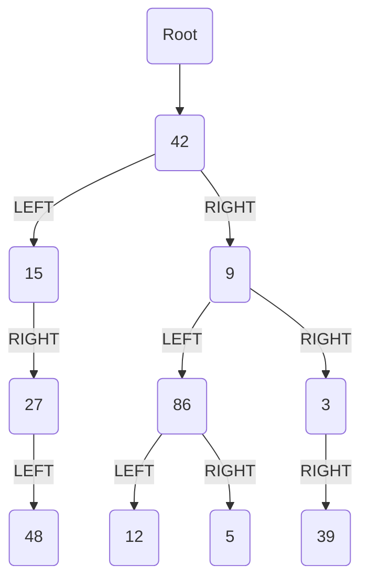

MIT License
Copyright (c) 2025 Emir Baha Yıldırım
Please see the LICENSE file for more details.

-------------------------------------------------------------------------------

# Trees

A **tree** is a directed, acyclic structure of linked nodes;
- **directed** because it only has a one-way link between nodes,
- **acyclic** because no path wraps back around to the same node twice.

A **binary tree** is a tree where each node has at most **two** children. It
can be defined as either:
- *empty* (`null`), or
- a *root* node that contains:
    - **data**
    - a **left subtree**, and
    - a **right subtree**.

- **Trees in Computer Science:** Examples include:
    - directories/files on a computer,
    - family genealogy; organizational charts,
    - AI: decision trees,
    - compilers: parse trees, and much more.

## Programming with Trees

Trees are a mixture of linked lists and recursion. They're considered very
elegant, even beautiful, by computer science nerds, and they're difficult for
novices to master. Sometimes you'll say "My code doesn't work, and I don't know
why!", and sometimes you'll say "My code works somehow, and I have no idea
why!"

## Tree Terminology

1. **Node:** An object containing a data value and left/right children.
2. **Root:** Topmost node of a tree.
3. **Leaf:** A node that has no children.
4. **Branch:** Any internal node; neither the root nor a leaf.
5. **Parent:** A node that refers to the current one.
6. **Child:** A node that the current node refers to.
7. **Sibling:** A node with a common parent.
8. **Subtree:** The tree of nodes reachable to the left/right from the current
node.
9. **Height:** Length of the longest path to a leaf from the given node.
10. **Depth:** Length of the path from the root to a given node.
11. **Full Tree:** A tree where every branch has 2 children.

## A Tree Node for Integers

A basic **tree node object** stores data and refers to left/right. Multiple
nodes can be linked together into a larger tree.

## Implementation of an Integer Binary Tree

### `IntTreeNode` Class

```cpp
// An IntTreeNode object is one node in a binaryt ree of integers.
class IntTreeNode {
public:
    int data; // data stored at this node
    IntTreeNode* left; // reference to left subtree
    IntTreeNode* right; // reference to right subtree

    IntTreeNode(int val) {
        this->data = val;
        this->left = nullptr;
        this->right = nullptr;
    }
    IntTreeNode(int val, IntTreeNode* left, IntTreeNode* right) {
        this->data = val;
        this->left = left;
        this->right = right;
    }
};
```

### `IntTree` Class

```cpp
// An IntTree object represents an entire binary tree of integers.
class IntTree {
private:
    IntTreeNode* root; // nullptr for an empty tree
public:
    ... // member functions
};
```

Client code talks to the `IntTree` not to the node objects inside it. Member
functions of the `IntTree` create and manipulate the nodes, their data, and
links between them.

#### `IntTree` Constructor

Assume we have the following constructors:
- `IntTree(IntTreeNode* right)`
- `IntTree(int height)`

The 2nd constructor creates a tree and fills it with nodes with random data
values from 1-100 until it's full at the given height.

#### Printing a Tree

We'll also add a member function `print` to the `IntTree` class that prints the
elements of the tree, separated by spaces. A node's left subtree should be
printed before it, and its right subtree should be printed after it.

```cpp
class IntTree {
public:
    void print() {
        this->print(root);
        std::cout << std::endl;
    }
    ...
    // other member functions
    ...
private:
    IntTreeNode* root;
    void print(IntTreeNode* right) {
        if(right != nullptr) {
            print(right->left);
            std::cout << right->data << ' ';
            print(right->right);
        }
    }
}
```

### Style for Tree Member Functions

Tree member functions are often implemented recursively;
- with a public/private pair
- the private version accepts the root node to process.

```cpp
class IntTree {
public:
    type function_name(parameters {
        function_name(root, parameters);
    }
    ...
private:
    type function_name(IntTreeNode* right, parameters) {
        ...
    }
};
```

## Traversals

- **Traversal:** An examination of the elements of a tree. A pattern is used
in many tree algorithms and member functions. The subtrees are also traversed
**recursively**! Common orderings for traversals include:
    - **Pre-Order:** Visit the *current* node, visit the *left* subtree, hen
    visit the *right* subtree.
    - **In-Order:** Visit *left* subtree, visit the *current* node, then visit
    the *right* subtree.
    - **Post-Order:** Visit the *left* subtree, visit the *right* subtree, then
    visit the *current* node.

### The Trick

To quickly generate a traversal:
- Trace a path around the tree.
- As you pass a node on the proper side, process it.
    - Pre-Order: left side
    - In-Order: bottom
    - Post-Order: right side

The fact that this works is amazing tbh.

-------------------------------------------------------------------------------

# Exercises

## Exercise 1

Give pre-, in-, and post-order traversals for the following tree:


<details>
    <summary> Solution </summary>


</details>
