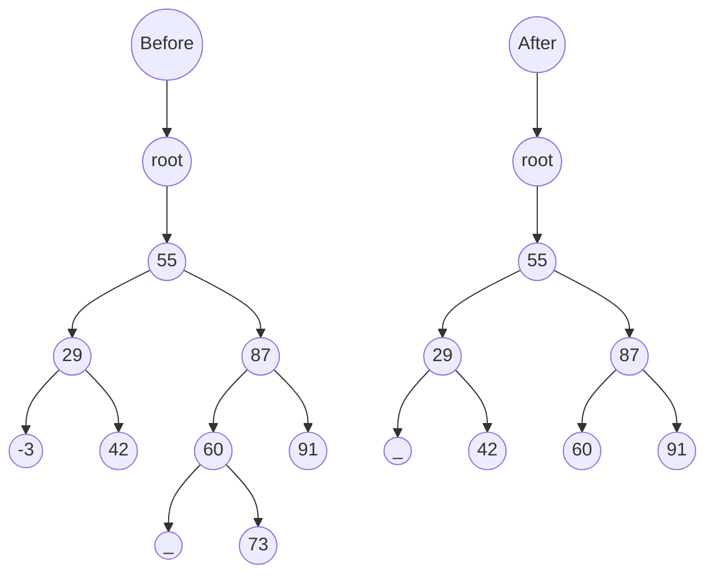
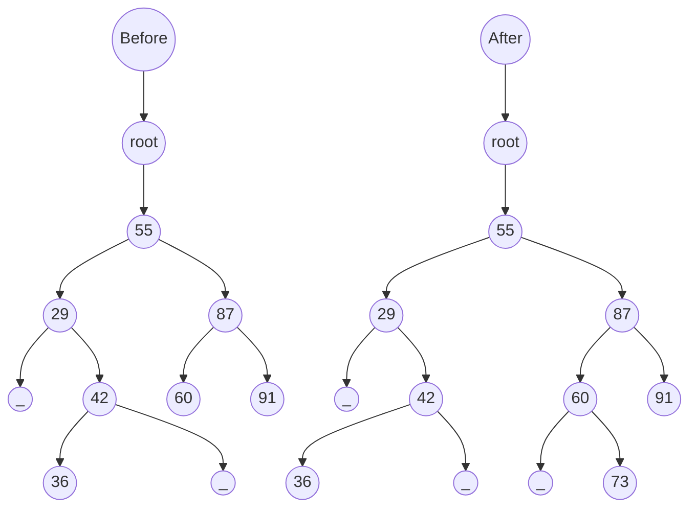

MIT License
Copyright (c) 2025 Emir Baha Yıldırım
Please see the LICENSE file for more details.

-------------------------------------------------------------------------------

# Trees

A **tree** is a directed, acyclic structure of linked nodes;
- **directed** because it only has a one-way link between nodes,
- **acyclic** because no path wraps back around to the same node twice.

A **binary tree** is a tree where each node has at most **two** children. It
can be defined as either:
- *empty* (`null`), or
- a *root* node that contains:
    - **data**
    - a **left subtree**, and
    - a **right subtree**.

- **Trees in Computer Science:** Examples include:
    - directories/files on a computer,
    - family genealogy; organizational charts,
    - AI: decision trees,
    - compilers: parse trees, and much more.

## Programming with Trees

Trees are a mixture of linked lists and recursion. They're considered very
elegant, even beautiful, by computer science nerds, and they're difficult for
novices to master. Sometimes you'll say "My code doesn't work, and I don't know
why!", and sometimes you'll say "My code works somehow, and I have no idea
why!"

## Tree Terminology

1. **Node:** An object containing a data value and left/right children.
2. **Root:** Topmost node of a tree.
3. **Leaf:** A node that has no children.
4. **Branch:** Any internal node; neither the root nor a leaf.
5. **Parent:** A node that refers to the current one.
6. **Child:** A node that the current node refers to.
7. **Sibling:** A node with a common parent.
8. **Subtree:** The tree of nodes reachable to the left/right from the current
node.
9. **Height:** Length of the longest path to a leaf from the given node.
10. **Depth:** Length of the path from the root to a given node.
11. **Full Tree:** A tree where every branch has 2 children.

## A Tree Node for Integers

A basic **tree node object** stores data and refers to left/right. Multiple
nodes can be linked together into a larger tree.

## Implementation of an Integer Binary Tree

### `IntTreeNode` Class

```cpp
// An IntTreeNode object is one node in a binaryt ree of integers.
class IntTreeNode {
public:
    int data; // data stored at this node
    IntTreeNode* left; // reference to left subtree
    IntTreeNode* right; // reference to right subtree

    IntTreeNode(int val) {
        this->data = val;
        this->left = nullptr;
        this->right = nullptr;
    }
    IntTreeNode(int val, IntTreeNode* left, IntTreeNode* right) {
        this->data = val;
        this->left = left;
        this->right = right;
    }
};
```

### `IntTree` Class

```cpp
// An IntTree object represents an entire binary tree of integers.
class IntTree {
private:
    IntTreeNode* root; // nullptr for an empty tree
public:
    ... // member functions
};
```

Client code talks to the `IntTree` not to the node objects inside it. Member
functions of the `IntTree` create and manipulate the nodes, their data, and
links between them.

#### `IntTree` Constructor

Assume we have the following constructors:
- `IntTree(IntTreeNode* right)`
- `IntTree(int height)`

The 2nd constructor creates a tree and fills it with nodes with random data
values from 1-100 until it's full at the given height.

#### Printing a Tree

We'll also add a member function `print` to the `IntTree` class that prints the
elements of the tree, separated by spaces. A node's left subtree should be
printed before it, and its right subtree should be printed after it.

```cpp
class IntTree {
public:
    void print() {
        this->print(root);
        std::cout << std::endl;
    }
    ...
    // other member functions
    ...
private:
    IntTreeNode* root;
    void print(IntTreeNode* root) {
        if(root != nullptr) {
            print(root->left);
            std::cout << root->data << ' ';
            print(root->right);
        }
    }
}
```

### Style for Tree Member Functions

Tree member functions are often implemented recursively;
- with a public/private pair
- the private version accepts the root node to process.

```cpp
class IntTree {
public:
    type function_name(parameters {
        function_name(root, parameters);
    }
    ...
private:
    type function_name(IntTreeNode* root, parameters) {
        ...
    }
};
```

## Traversals

- **Traversal:** An examination of the elements of a tree. A pattern is used
in many tree algorithms and member functions. The subtrees are also traversed
**recursively**! Common orderings for traversals include:
    - **Pre-Order:** Visit the *current* node, visit the *left* subtree, hen
    visit the *right* subtree.
    - **In-Order:** Visit *left* subtree, visit the *current* node, then visit
    the *right* subtree.
    - **Post-Order:** Visit the *left* subtree, visit the *right* subtree, then
    visit the *current* node.

### The Trick

To quickly generate a traversal:
- Trace a path around the tree.
- As you pass a node on the proper side, process it.
    - Pre-Order: left side
    - In-Order: bottom
    - Post-Order: right side

The fact that this works is amazing tbh.

## Exercise

Give pre-, in-, and post-order traversals for the following tree:


<details>
    <summary> Solution </summary>

1. **Pre-Order**
```console
42 15 27 48 9 86 12 5 3 39
```
2. **In-Order**
```console
15 48 27 42 86 5 12 9 3 39
```
3. **Post-Order**
```console
48 27 15 5 12 86 39 3 9 42
```
</details>

## Traversals

### Pre-order Traversal

```cpp
void preOrder(IntTreeNode* root) {
    if(root != nullptr) {
        std::cout << root->data << ' ';
        preOrder(root->left);
        preOrder(root->right);
    }
}
```

### Post-order Traversal

```cpp
void postOrder(IntTreeNode* root) {
    if(root != nullptr) {
        postOrder(root->left);
        postOrder(root->right);
        std::cout << root->data << ' ';
    }
}
```

## Exercise

Write a member function named `printSideways` to the `IntTree` class that
prints the tree in a sideways indented format, with right nodes above the roots
above left nodes, with each level 4 spaces more indented than the one above it.


Example Output:
```text
           19
     14      
           11
9     
           7
     6
```

<details>
    <summary> Solution </summary>

```cpp
void printSideways() {
    printSideways(root, " ");
}

void printSideways(IntTreeNode* root, std::string indent) {
    printSideways(root->right, indent + "   ")
    std::cout << indent << root->data << std::endl;
    printSideways(root->left, indent + "   ")
}
```
</details>

## Finding the Maximum Value in a Binary Tree

```cpp
class IntTree {
public:
    ...
    int getMax() {
        return getMax(root);
    }
private:
    IntTreeNode* root;
    ...
    int getMax(IntTreeNode* root) {
        int root_val, left, right, max;
        max = -1 // assuming all values are positive integers
        if(root != nullptr) {
            root_val = r->data;
            left = getMax(root->left);
            right = getMax(root->right);
            // find the largest oef the three values
            if(left > right) {
                max = left;
            }
            else {
                max = right;
            }
            if(root_val > max) {
                max = root_val;
            }
        }
        return max;
    }
}
```

## Adding Up All Values in a Binary Tree

```cpp
int findSum(IntTreeNode* root) {
    if(root == nullptr) {
        return 0;
    }
    else {
        return (root->data + findSum(root->left) + findSum(root->right));
    }
}
```

## Exercise

Write a method `countLeaves` to the `IntTree` class that counts the leaves of a
binary tree.

```cpp
class IntTree {
public:
    int countLeaves() {
        return countLeaves(root);
    }
private:
    int countLeaves(IntTreeNode* root) {
        // TODO
    }
}
```

<details>
    <summary> Solution </summary>

```cpp
class IntTree {
public:
    int countLeaves() {
        return countLeaves(root);
    }
private:
    int countLeaves(IntTreeNode* root) {
        // TODO: IMPLEMENT
    }
}
```
</details>

## Tree Height

Height of a binary tree T can be defined recursively as:
- If T is empty, its height is -1,
- If T is a non-empty tree, then since T is of the form

the height of T is 1 greater than the height of its root's taller subtree, i.e.
$`height(T) = 1 + max(height(T_L), height(T_R))`$

### Number of Binary Trees with The Same Number of Nodes

- $`n=0 \rightarrow \text{ empty tree}`$
- $`n=1 \rightarrow 1 \text{ tree}`$
- $`n=2 \rightarrow 2 \text{ trees}`$
- $`n=3 \rightarrow 5 \text{ trees}`$

- General Formula:

$`\text{Catalan Number } C(n) = \frac{(2n)!}{(n+1)!\cdot n!}`$

- Different number of structurally different Binary Trees: $`C(n)`$
- Different number of Binary Trees: $`n!\cdot C(n)`$

## Useful Binary Tree Numbers

If $`h`$ is the height of the binary tree, then:
- **Max Number of Leaves:** $`2^h`$
- **Max Number of Nodes:** $`2^{h + 1} - 1`$
- **Min Number of Leaves:** $`1`$
- **Min Number of Nodes:** $`h + 1`$

-------------------------------------------------------------------------------

# Binary Search Trees (BSTs)

A binary search tree (BST) is a binary tree that is either:
- empty (`null`), or
- a root node `R` such that:
    - every element of `R`'s left subtree contains data **less than** R's data,
    - every element of `R`'s right subtree contains data **greater than** R's
    data,
    - `R`'s left and right subtrees are also binary search trees.

- BSTs store their elements in sorted order, which is helpful for
searching/sorting tasks.

## In-Order Traversal of BST

Let's work out the **in-order traversal** results of the following two valid
BSTs.


For both, in-order traversal gives the same result:
```
1 5 10 15 20 30
```
Meaning that they're clearly sorted.

> [!IMPORTANT]
> DO NOT CONFUSE THESE:
> **Binary Search:** an algorithm on a sorted <u>array</u>.
> **Binary Tree:** a tree where nodes have no more than 2 children.
> **Binary Search Tree:** a binary tree with a special ordering property.

## Search in a BST

Yes, don't confuse `binary search` and `binary search trees`; however, they are
related, because the way you search in a `BST` is similar to performing a
binary search in an ordered array.

To summarize the algorithm, you start from the root node, then choose to go
left or right depending on the comparison result. The search ends when either
you've found your target, or you've reached a leaf. The maximum number of steps
is the tree height. As in binary search, search in the BST can achieve
$`O(\log{n}`$ time; however, this requires the BST to be balanced, i.e. the
height should be small. If you have a poorly constructed BST, e.g. degenerated
to a linked list, you won't get the $`O(\log{n})`$ performance.

## BST Implementation of a Dictionary ADT

You can use a BST to implement a dictionary ADT, just add a value field to the
nodes, so each node represents a key-value pair.

```cpp
template<class K, class V> class Node {
public:
    K key;
    V val;
    Node<K, V>* le;
    Node<K, V>* ri;
}
```

For simplicity, we'll just talk about the keys, `int data`. Interactions
between nodes are established by keys, e.g. BST sorts by keys. In other words,
keys determine where the nodes go.

## Binary Search Tree Class

Let's convert the `IntTree` class into a `SearchTree` class, so that the
elements of the tree will constitute a legal binary search tree. We'll add a
member function `contains` to the `SearchTree` class that searches the tree for
a given integer, returning `true` if found. If a `SearchTree` variable `tree`
referred to the tree below, following calls would have these results:


```cpp
tree.contains(29) // TRUE
tree.contains(55) // TRUE
tree.contains(63) // FALSE
tree.contains(35) // FALSE
```

### Member Function - `contains`

```cpp
class SearchTree {
public:
    bool contains(int val) {
        return contains(root, val);
    }
private:
    bool contains(IntTreeNode* root, int val) {
        if(root == nullptr) {
            return false;
        }
        else {
            if(root->data == val) {
                return true;
            }
            else if(root->data > val) {
                return contains(root->left, val);
            }
            else {
                return contains(root->right, val);
            }
        }
    }
}
```

### Adding to a BST

Suppose we want to add the value 14 to the BST below.


Where should the new node be added? Where would we add the value 3, or 7? If
the tree is empty, where should a new value be added? What is the general
algorithm?

### Implementing `add`

Let's add a member function `add` to the `SearchTree` class that adds a given
integer value to the tree. Assume that the elements of the `SearchTree`
constitute a legal binary search tree, and add the new value in the appropriate
place to maintain ordering.
```cpp
tree.add(49);
```


```cpp
class SearchTree {
public:
    void add(int val) {
        add(root, val);
    }
private:
    void add(IntTreeNode* &root, int val) {
        if(root == nullptr) {
            root = new IntTreeNode(val);
        }
        else if(root->data > val) {
            add(root->left, val);
        }
        else if(root->data < val) {
            add(root->right, val);
        }
        // else, val is a duplicate
    }
}
```
Now, think about the case when `root` is a leaf.

## Exercise - `getMin`

Write a member function `getMin` to the `SearchTree` class that returns the
minimum integer value from the tree. Assume that the elements of the
`SearchTree` constitute a legal binary search tree. Throw a
`NoSuchElementException` if the tree is empty.

- Example


```cpp
int min = tree.getMin() // -3
```

<details>
    <summary> Solution </summary>

```cpp
class SearchTree {
public:
    int getMin() {
        if(this->root == nullptr) {
            throw new NoSuchElementException();
        }
        return getMin(root);
    }
private:
    int getMin(IntTreeNode* root) {
        if(root->left == nullptr) {
            return root->data;
        }
        else {
            return getMin(root->left);
        }
    }
}
```
</details>

## Exercise - `getMax`

Write a member function `getMax` to the `SearchTree` class that returns the
maximum integer value from the tree. Assume that the elements of the
`SearchTree` constitute a legal binary search tree. Throw a
`NoSuchElementException` if the tree is empty.

- Example


```cpp
int min = tree.getMax() // 91
```

<details>
    <summary> Solution </summary>

```cpp
class SearchTree {
public:
    int getMax() {
        if(this->root == nullptr) {
            throw new NoSuchElementException();
        }
        return getMax(root);
    }
private:
    int getMax(IntTreeNode* root) {
        if(root->left == nullptr) {
            return root->data;
        }
        else {
            while(root->right != nullptr) {
                root = root->right;
            }
            return root->data;
        }
    }
}
```
</details>

## Exercise - `remove`

Write a member function `remove` to the `SearchTree` class that removes a given
integer value from the tree, if present. Assume that the elements of the
`SearchTree` constitute a legal binary search tree. Throw a
`NoSuchElementException` if the tree is empty, and remove the value in such a
way as to maintain ordering.

- Example

```cpp
tree.remove(73);
tree.remove(29);
tree.remove(87);
tree.remove(55);
```

Possible cases for the node to be removed:
1. Case: *a leaf*
2. Case: *a node with only one child (left or right)*
3. Case: *a node with both children*

1. Case 1 - Node == Leaf
- Replace with null
```cpp
tree.remove(73);
```

<!-- TODO: ABOVE GRAPH IS WRONG, FIX NEEDED-->

<details>
    <summary> Solution </summary>

```cpp
class SearchTree {
public:
    int getMax() {
        if(this->root == nullptr) {
            throw new NoSuchElementException();
        }
        return getMax(root);
    }
private:
    int getMax(IntTreeNode* root) {
        if(root->left == nullptr) {
            return root->data;
        }
        else {
            while(root->right != nullptr) {
                root = root->right;
            }
            return root->data;
        }
    }
}
```
</details>
