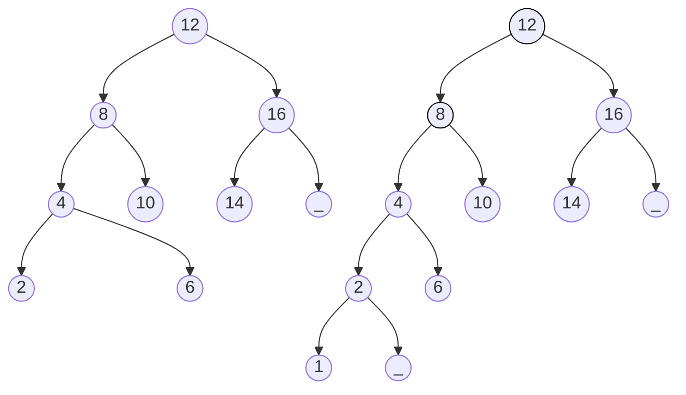

MIT License
Copyright (c) 2025 Emir Baha Yıldırım
Please see the LICENSE file for more details.

-------------------------------------------------------------------------------

# AVL Trees

An AVL tree is a binary search tree with a balance condition. AVL is named
after its inventors <i><b>A</b>del'son-<b>V</b>el'skii and <b>L</b>andis</i>.
An AVL tree *approximates* the ideal tree, which is a completely balanced tree,
and maintains a height close to the minimum.

<blockquote>
    <b> Definiton: </b>
    
<i>
        An AVL tree is a binary search tree such that for any node in the tree,
        the height of the left and right subtrees can differ by at most 1.
    </i>

</blockquote>

## Example

Two binary search trees:
1. an AVL tree
2. not an AVL tree (unbalanced nodes are lightened)

