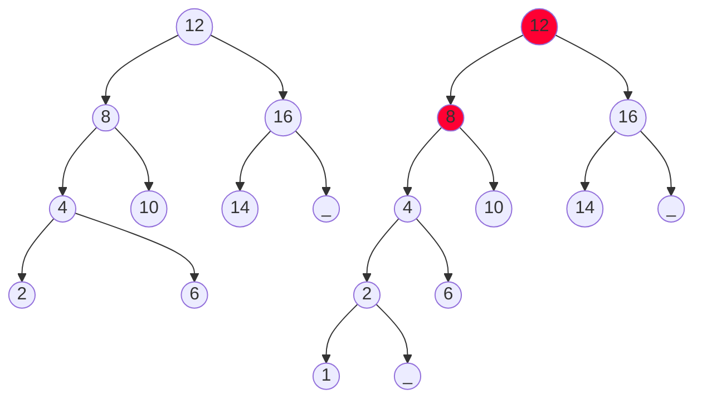

MIT License
Copyright (c) 2025 Emir Baha Yıldırım
Please see the LICENSE file for more details.

-------------------------------------------------------------------------------

# AVL Trees

An AVL tree is a binary search tree with a balance condition. AVL is named
after its inventors <i><b>A</b>delson-<b>V</b>elskii and <b>L</b>andis</i>.
An AVL tree *approximates* the ideal tree, which is a completely balanced tree,
and maintains a height close to the minimum.

<blockquote>
    <b> Definiton: </b>
    
<i>
        An AVL tree is a binary search tree such that for any node in the tree,
        the height of the left and right subtrees can differ by at most 1.
    </i>

</blockquote>

## Example

Two binary search trees:
1. an AVL tree
2. not an AVL tree (unbalanced nodes are shown in red)

> [!NOTE]
> ## Properties of AVL Trees
> 1. The depth of a typical node in an AVL tree is very close to the optimal
> $`\log_2{n}`$. Consequently, all searching operations in an AVL tree have
> logarithmic worst case bounds.
> 2. An update (insert or remove) in an AVL tree could destroy the balance. It,
> then, must be **rebalanced** before the operation can be considered complete.
> 3. **After an insertion, only nodes that are on the path from the insertion
> point to the root can have their balances altered.**

> [!IMPORTANT]
> ## Rebalancing
> Suppose the node to be rebalanced is `x`. There are 4 cases that we might
> have to fix, two are the mirror images of the other two.
> 1. **An insertion in the left subtree of the left child of `x`.**   <!-- 1 -->
> 2. *An insertion in the left subtree of the right child of `x`.*    <!-- 3 -->
> 3. **An insertion in the right subtree of the right child of `x`.** <!-- 4 -->
> 4. *An insertion in the right subtree of the left child of `x`.*    <!-- 2 -->
> Balance is restored by **tree** ***rotations***.

### Balancing Operations: *Rotations*

- Case 1 and case 3, are symmetric and requires the same operation for balance,
they are handled by <u><i>single rotation</i></u>.

- Case 2 and case 4, are symmetric and requires the same operation for balance,
they are handled by <u><i>double rotation</i></u>.

#### *Single Rotation*

A ***single rotation*** switches the roles of the parent and child while
maintaining the search order. We rotate between a node and its child, where
child becomes parent, and parent becomes right child in `case 1` and left child
in `case 3`. The result is a binary search tree that satisfies the AVL property.

